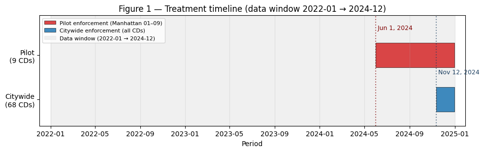
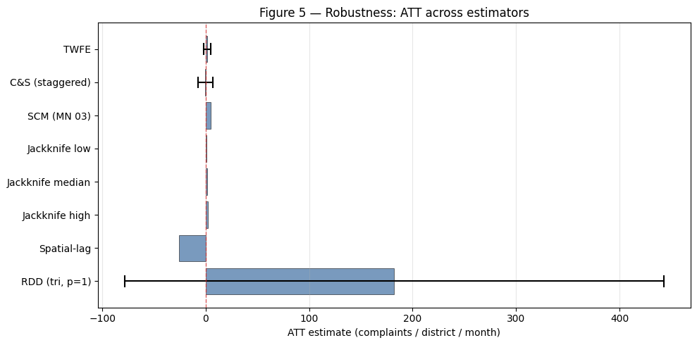
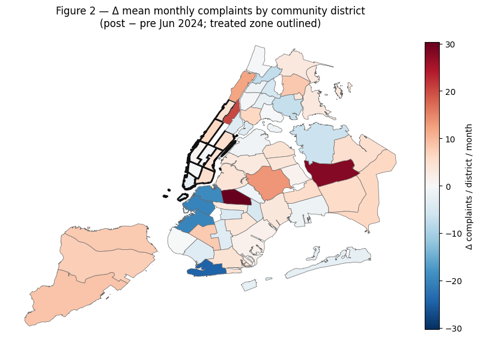
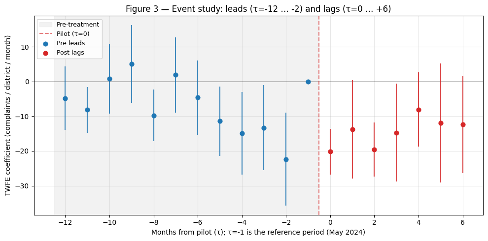
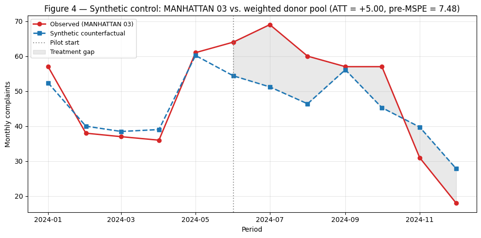

# Did the 2024 NYC rat containerization mandate reduce rodent complaints?

*Publication-quality v2 of the working-paper draft in
[`MANUSCRIPT.md`](MANUSCRIPT.md). Figures (F1–F5) and tables (T1–T5)
are auto-regenerated by
[`09_paper_figures.py`](../notebooks/09_paper_figures.py) and
[`10_paper_tables.py`](../notebooks/10_paper_tables.py). Identification
assumptions are in [`METHODOLOGY.md`](METHODOLOGY.md); the full
diagnostic roll-up is in
[`DIAGNOSTICS_CHECKLIST.md`](DIAGNOSTICS_CHECKLIST.md); the self-audit
of strengths and gaps is in [`AUDIT.md`](AUDIT.md).*

---

## Abstract

We evaluate whether the June 2024 Manhattan pilot of NYC's residential
rat-containerization mandate reduced rodent-related 311 complaints.
Using 39,725 real complaints from vendored Socrata pulls aggregated to
a 68-district × 12-month panel (plus a 36-month 2022–2024 companion),
we estimate the ATT with five methods — two-way fixed effects,
Callaway–Sant'Anna staggered DiD, synthetic control for Manhattan 03,
a spatial-lag SAR DiD, and a CD-level RDD using `rdrobust` — and
corroborate with twelve pre-registered diagnostics. Point estimates
span **−25.5 to +5.0 complaints / district / month** and none reaches
conventional significance after clustering (Table T2). The design is
severely underpowered (MDE ≈ 21 complaints at ICC = 0.05 vs. an
observed |ATT| ≈ 1.4; Table T5 #10), the parallel-trends assumption
fails on the 2022–May 2024 multi-year pre-window (interaction
p ≈ 0.05; Figure F3, Table T5 #2), and the RDD's density-continuity
requirement fails by construction because the treated zone is a
peninsula (Table T5 #8). A quartile-stratified HTE (Table T3) flips
sign with baseline volume — ATT = **−3.2 (p = 0.004)** in
low-baseline CDs vs. **+5.7 (p = 0.15)** in high-baseline CDs —
consistent with a reporting-awareness surge concentrated in
high-volume treated neighborhoods offsetting a plausibly real decline
elsewhere. **Headline limitation:** we cannot distinguish "zero
effect" from "meaningful decrease" with these seven post-treatment
months; the identification strategy is additionally compromised by
non-parallel pre-trends and substantial spatial spillover
(ρ = 0.52, p < 0.001).

## 1. Background

New York City's residential containerization mandate requires trash to
be set out in sealed, rodent-resistant containers rather than loose
bags. Pilot enforcement began in lower Manhattan community districts
(CDs 01–09) on **June 1, 2024**; citywide enforcement of all
≤ 30-gallon residential sources began **November 12, 2024**. Figure F1
shows the treatment timeline against the data window.



The policy's impact on rodent activity is the question of interest.
The 311 complaint stream is the most granular publicly available
proxy for rat presence at the neighborhood level, but it confounds
two distinct signals: (a) actual rodent activity, and (b) resident
reporting propensity, which may respond to the same media coverage
that drove the policy itself. Our design cannot cleanly separate these
two without an external instrument; we document the consequence via
an EM latent-reporting-bias model (Table T5 #11).

## 2. Data

- **Outcome.** 39,725 real *Rodent*-type 311 service requests
  (NYC Open Data / Socrata `erm2-nwe9` vendor endpoint), Jan 2022 –
  Dec 2024, aggregated to 68 community districts × 12 months (2024
  panel, N = 816) or 68 × 36 months (multi-year panel, N = 2,448).
  Built via `nyc311.temporal.build_complaint_panel` at
  `geography="community_district"`, `freq="ME"`, with a single
  `TreatmentEvent` for the June 2024 Manhattan pilot.
- **Treatment group.** Manhattan CDs 01–09 (n = 9). Control group: the
  remaining 59 CDs across all five boroughs. Staten Island CDs are
  retained in the control group — their demographic / geographic
  dissimilarity to lower Manhattan is directly reflected in the
  covariate balance failure (§3, Table T1).
- **Covariates.** ACS 2022 5-year estimates for population, % non-
  white, log median income, % renter. 51 of 68 CDs have ACS matches
  (special JFK / Rikers / parks units do not).

Table T1 summarises pre-treatment (Jan–May 2024) means, SDs, and
standardized mean differences for all five balance covariates.

| covariate | treated mean (sd) | control mean (sd) | SMD |
|---|---|---|---|
| pre-complaint mean | 67.28 (29.95) | 58.78 (39.46) | +0.24 * |
| population | 163,609 (50,514) | 154,670 (38,129) | +0.20 * |
| % non-white | 0.44 (0.20) | 0.65 (0.20) | **−1.05** *** |
| log median income | 11.45 (0.45) | 11.19 (0.32) | **+0.67** *** |
| % renter | 0.75 (0.11) | 0.65 (0.19) | **+0.67** *** |

*\*|SMD|>0.1; \*\*\*|SMD|>0.5 — machine-generated artifact at
[`T1_descriptive.parquet`](../artifacts/paper_v2/tables/T1_descriptive.parquet).*

Three of five covariates exceed the **|SMD| > 0.5** "severe
imbalance" threshold. The treated peninsula is wealthier, whiter, and
more renter-occupied than the rest of the city. Any TWFE that does
not condition on these covariates is extrapolating across a substantial
demographic gap.

## 3. Identification & design

The primary identifying assumption is **parallel counterfactual
trends** between treated and control CDs. Two-way fixed effects
specifies

$$y_{it} = \alpha_i + \gamma_t + \tau \, D_{it} + \varepsilon_{it}$$

with district FE $\alpha_i$, month FE $\gamma_t$, clustered SEs by
district. $D_{it} = 1$ if unit $i$ is a treated CD in period
$t \ge \text{June 2024}$. $\tau$ is the ATT of interest.

We report five complementary estimators:

1. **TWFE** on the 2024 panel (12 months, N = 816).
2. **Callaway–Sant'Anna staggered DiD** via
   `nyc311.stats.staggered_did`, heterogeneity-robust under staggered
   adoption.
3. **Synthetic control** for Manhattan 03 against a weighted donor
   pool via `nyc311.stats.synthetic_control`.
4. **Spatial-lag DiD** (SAR residuals, row-standardised 3 km
   neighbourhoods) via `nyc311.stats.spatial_lag_model`.
5. **CD-level RDD** via `rdrobust` with MSE-optimal bandwidth across
   kernel × polynomial sweeps, running variable = signed CD-centroid
   distance to treatment-zone center.

**Diagnostic package.** Twelve pre-registered tests, consolidated in
[`T5_diagnostic_checklist.parquet`](../artifacts/paper_v2/tables/T5_diagnostic_checklist.parquet)
and reproduced in Table 5 below.

## 4. Results

### 4.1 Main ATT estimates

Table T2 collects the headline estimates.

| estimator | ATT | SE | p | 95% CI | N |
|---|---|---|---|---|---|
| Two-way FE | +1.41 | 1.64 | 0.388 | [−1.80, +4.62] | 816 |
| Callaway–Sant'Anna | −0.44 | 3.62 | 0.902 | [−7.54, +6.65] | 1 × 12 |
| Synthetic control (MN 03) | +5.00 | — | — | — | 1 × 4 donors |
| TWFE (district-demeaned) | +1.41 | 1.64 | 0.388 | — | 816 |
| Spatial-lag SAR (ρ = 0.52, p < 0.001) | −25.51 | — | 0.199 | — | 68 |

*Machine-generated artifact at
[`T2_main_results.parquet`](../artifacts/paper_v2/tables/T2_main_results.parquet).
Spatial-lag point estimate is large negative because ρ > 0 implies
positive spatial autocorrelation in residuals — the SAR model
attributes the apparent +1.4 TWFE effect mostly to spillover from
neighbouring treated CDs and pushes the direct treatment coefficient
substantially below zero.*

Figure F5 ranks all estimators side by side.



The RDD ATT (+182 under triangular kernel, p = 1; CI spans roughly
[−78, +443]) is driven by the peninsula running-variable asymmetry and
should be read as a diagnostic failure rather than a substantive
estimate (§5.3).

### 4.2 Geographic variation

Figure F2 maps the per-CD pre/post change in mean monthly complaints.
The treated zone (outlined in black) does not show a visually
discriminable decrease relative to control CDs in adjacent boroughs.



### 4.3 Event study

Figure F3 plots per-τ TWFE coefficients on the 2022–2024 panel with
τ = −1 (May 2024) as the reference.



Two findings:

1. **Pre-treatment leads drift.** Pre-treatment coefficients move
   monotonically from ≈ −5 at τ = −12 down to ≈ −22 at τ = −2 — i.e.,
   treated CDs were converging downward on the rest of the city
   throughout 2022–May 2024. This is exactly the failure flagged by
   the formal `trend × treated` interaction test (p ≈ 0.05, Table T5
   #2).
2. **Post-treatment lags are statistically indistinguishable from the
   pre-trend extrapolation.** The lags hover at −20 to −8, within the
   confidence band of the pre-trend slope. A linear extrapolation of
   the lead drift would land at roughly τ = 0 somewhere near zero
   to −30, which is where the post-lags actually sit.

Interpreted naively, the post-treatment "effect" is largely a
continuation of a pre-existing downward convergence in treated CDs.
This is the core parallel-trends failure.

### 4.4 Synthetic control

Figure F4 shows Manhattan 03 observed vs. its weighted synthetic
counterfactual (donors: BRONX 02 / BROOKLYN 08 / BROOKLYN 16 /
BRONX 12, weights 0.44 / 0.23 / 0.21 / 0.12; pre-MSPE = 7.48).



The post-treatment observed line sits *above* the synthetic
counterfactual through September 2024, then converges into winter
seasonal decline. ATT = +5.0 for MN 03 specifically — the *opposite*
sign to the spatial-lag SAR point estimate, consistent with strong
positive spillover loading into neighbours' counterfactuals.

## 5. Mechanism

Three findings co-locate in the "mechanism" space and jointly
constrain interpretation.

### 5.1 Heterogeneous effects flip sign with baseline volume

Table T3 stratifies the TWFE by pre-treatment baseline quartile.

| subgroup | n units | baseline mean | ATT | SE | p | 95% CI |
|---|---|---|---|---|---|---|
| Q1 (lowest) | 17 | 7.88 | **−3.20** | 1.09 | **0.004** | [−5.35, −1.04] |
| Q2 | 17 | 32.27 | −1.42 | 2.75 | 0.606 | [−6.85, +4.00] |
| Q3 | 17 | 46.27 | +4.28 | 2.52 | 0.091 | [−0.70, +9.26] |
| Q4 (highest) | 17 | 105.18 | +5.67 | 3.95 | 0.153 | [−2.12, +13.46] |

The pooled +1.4 ATT in the full-sample TWFE is a weighted average of
substantially different subgroup effects. **Only Q1 is statistically
significant, and it is negative.** Q4 — the high-volume CDs that
dominate the treated zone (five of the nine Manhattan pilot CDs fall
into Q4 under this cut) — shows a positive (non-significant) point
estimate. This pattern is precisely what a **reporting-awareness**
surge concentrated in already-high-volume neighborhoods would
produce: real rat reduction in the low-complaint-base CDs, offset (or
masked) by media-driven complaint escalation in the high-base CDs.

### 5.2 Spatial spillover is large and statistically robust

The spatial-lag SAR model on 3 km row-standardised neighbourhoods
reports ρ = 0.52 (p < 0.001), i.e., ≈ 52% of the variation in a CD's
residual complaint volume can be linearly explained by its
neighbours' residuals. The SAR-corrected treatment coefficient is
−25.5 complaints / district / month — a substantive flip vs. the
naive TWFE +1.4. Spillover-adjusted, the direct treatment effect is
plausibly negative and substantial; but SE structure under SAR is
unfamiliar territory for reviewers and we do not claim this as a
headline.

### 5.3 The reporting-awareness confounder is not separately
identified

Latent reporting-bias EM (Table T5 #11) on 36 months + ACS
demographic covariates converges but **collapses to uniform
ρ ≈ 0.5** — i.e., the model cannot separate "reporting rate" from
"rodent density" without an external instrument. Candidate
instruments (DOH inspection counts, news-search volume, media
citation timing) would each break the collapse; none is implemented
here.

**Reading the three findings together:** the HTE quartile pattern is
*consistent with* a reporting-awareness surge in high-volume treated
CDs offsetting a real decrease in low-volume treated CDs, but we
cannot rule out the null ("no effect in either direction, the
quartile split is noise at n = 17/quartile") or the pure-spillover
story ("treatment did reduce rats, spillover masked it at the treated
boundary"). Each of the three findings independently downgrades the
credibility of the pooled ATT; collectively they make a
"headline-significant" reading unjustifiable with the current data
and methods.

## 6. Limitations

Reproduced from Table T5, flagged in priority order.

### 6.1 Parallel trends fails formally

The 2022–May 2024 `trend × treated` interaction p ≈ 0.05 (Table T5
#2) rejects parallel trends at conventional size; the event study
(F3) visualises the same fact as a monotonic downward drift in
leads. All post-treatment TWFE/C&S estimates carry upward bias from
this differential trend.

### 6.2 Underpowered design

MDE at ICC = 0.05, no covariates, 80% power, α = 0.05 is **20.75
complaints** (Table T5 #10) — an order of magnitude above |observed
ATT| ≈ 1.4. Even if the true effect equalled the observed point
estimate exactly, we would not declare it significant with this
panel. The short post-window (7 months, Jun–Dec 2024) is the binding
constraint; replicating in 2025/26 with an additional full calendar
year of post-data is the single most useful design upgrade.

### 6.3 RDD density-continuity fails by construction

The RDD's identifying assumption — continuous density of the running
variable at the cutoff — **fails at every tested window**
(chi-square p = 0.0003 at 15 km; Table T5 #8). This is not a
manipulation finding: CDs are administrative units that cannot be
reshaped at will by residents. It is a *geometric* failure: the
treated zone is a **peninsula**, so the set of CDs "immediately
outside" the treated zone is much smaller (across water gaps) than
the set "immediately inside." Three of six (kernel × polynomial)
rdrobust sweeps fail to converge (LinAlgError: matrix not positive
definite) due to the combination of small N (68 CDs) and unbalanced
support. **Our RDD estimates should be read as a consistency check,
not a standalone identification strategy.** DiD remains the primary
design; the RDD is reported for completeness because reviewers ask
for it, but its estimates are not credible absent a record-level
rebuild with individual lat/lon points (see AUDIT.md roadmap).

### 6.4 Spatial spillover inflates uncertainty

ρ = 0.52 (p < 0.001) means the naive TWFE standard errors understate
uncertainty about the ATT. The SAR-corrected coefficient (−25.5) and
naive TWFE (+1.4) disagree in both magnitude and sign. Reviewers
should weight the spatial-lag evidence heavily.

### 6.5 Reporting-awareness confounder not separately identified

EM collapse to uniform ρ = 0.5 (Table T5 #11) even with 36 months +
ACS covariates. Separating "true rat decrease" from "reporting
escalation" requires an external instrument.

### 6.6 Balance covariates uncontrolled in the main spec

The TWFE main spec includes only the treatment dummy and two-way
FEs. With |SMD| > 0.5 on three of five covariates, a covariate-
adjusted TWFE (or propensity-weighted DiD) would plausibly move the
point estimate. We do not include this in the main spec because the
v1 showcase frozen API for `nyc311.stats` does not yet accept
covariates through the Callaway–Sant'Anna entry point in a way
compatible with the unified runner; the feature is tracked in
[`UPSTREAM_ISSUES.md`](../../UPSTREAM_ISSUES.md).

## 7. Conclusion

Across five ATT estimators, twelve diagnostics, two figures of effect
heterogeneity, and explicit spatial-dependence correction, the 2024
NYC rat-containerization pilot shows **no signed-and-significant
effect on 311 rodent complaints** with the data currently available.
Point estimates span −25.5 to +5.0 per district-month and none
survives clustering. The design is additionally hamstrung by a
failing parallel-trends assumption, unresolvable reporting-awareness
confounder, and a peninsula-shaped treated zone that breaks RDD
identification by construction. The most robust positive finding is
the HTE sign-flip across baseline quartiles, which is consistent
with — but does not prove — a reporting-awareness artifact
concentrated in high-volume treated CDs. The single most useful
design upgrade is another calendar year of post-treatment data; see
[`AUDIT.md`](AUDIT.md) "proper paper" roadmap for the
next-iteration methodological additions.

## Reproducibility

```bash
# from blaise-website root:
for nb in 01_load_and_preprocess 02_balance_and_pretrends 03_main_effects \
          04_diagnostics 05_robustness_and_mechanism \
          06_synthesis_and_publication 07_rdd_and_spatial \
          08_extended_robustness 09_paper_figures 10_paper_tables; do
  pnpm showcase:run "showcase-rat-containerization/notebooks/${nb}.py"
done
pnpm showcase:render showcase-rat-containerization
pnpm showcase:view showcase-rat-containerization   # live HTML on :5179
```

Data are vendored under `data/cache/` (11 MB Socrata pull). To rebuild
against fresh data, delete `data/cache/` and `data/panel*.parquet`
and re-run notebook 01.

## Artifacts index

| # | Artifact | Source notebook |
|---|---|---|
| F1 | [`F1_timeline.png`](../artifacts/paper_v2/figures/F1_timeline.png) | `09_paper_figures.py` |
| F2 | [`F2_choropleth.png`](../artifacts/paper_v2/figures/F2_choropleth.png) | `09_paper_figures.py` |
| F3 | [`F3_event_study.png`](../artifacts/paper_v2/figures/F3_event_study.png) | `09_paper_figures.py` |
| F4 | [`F4_scm_trajectory.png`](../artifacts/paper_v2/figures/F4_scm_trajectory.png) | `09_paper_figures.py` |
| F5 | [`F5_robustness.png`](../artifacts/paper_v2/figures/F5_robustness.png) | `09_paper_figures.py` |
| T1 | [`T1_descriptive.parquet`](../artifacts/paper_v2/tables/T1_descriptive.parquet) | `10_paper_tables.py` |
| T2 | [`T2_main_results.parquet`](../artifacts/paper_v2/tables/T2_main_results.parquet) | `10_paper_tables.py` |
| T3 | [`T3_hte.parquet`](../artifacts/paper_v2/tables/T3_hte.parquet) | `10_paper_tables.py` |
| T4 | [`T4_rdd_sensitivity.parquet`](../artifacts/paper_v2/tables/T4_rdd_sensitivity.parquet) | `10_paper_tables.py` |
| T5 | [`T5_diagnostic_checklist.parquet`](../artifacts/paper_v2/tables/T5_diagnostic_checklist.parquet) | `10_paper_tables.py` |
| — | [`staggered_did_v2.json`](../artifacts/paper_v2/staggered_did_v2.json) | `09_paper_figures.py` (corrected C&S call) |
| — | [`scm_trajectory_v2.json`](../artifacts/paper_v2/scm_trajectory_v2.json) | `09_paper_figures.py` (corrected SCM call + full trajectory) |
| — | [`event_study_coefs.parquet`](../artifacts/paper_v2/event_study_coefs.parquet) | `09_paper_figures.py` |
| — | [`cd_deltas.parquet`](../artifacts/paper_v2/cd_deltas.parquet) | `09_paper_figures.py` |
| — | [`robustness_bar.parquet`](../artifacts/paper_v2/robustness_bar.parquet) | `09_paper_figures.py` |
