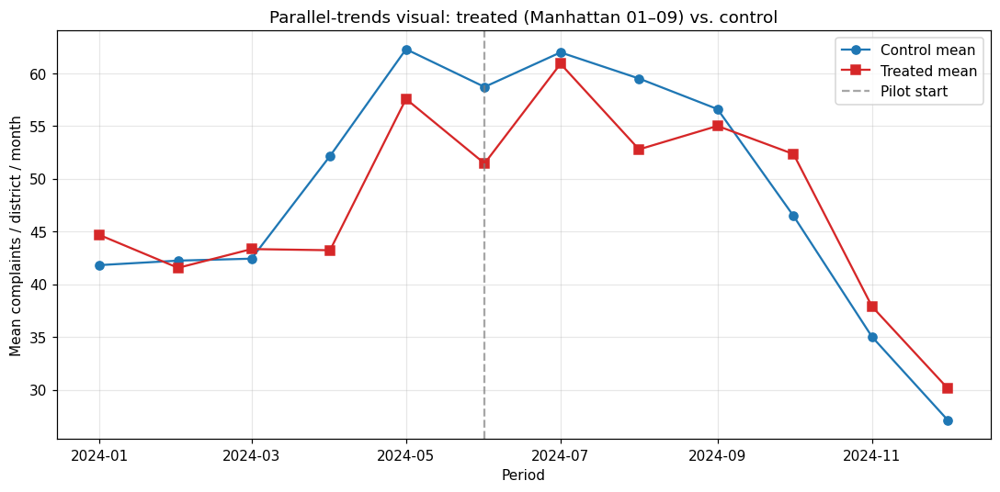

# 02 — Balance + parallel-trends (NEW vs. upstream)

> **Tearsheet** for [`notebooks/02_balance_and_pretrends.py`](../../notebooks/02_balance_and_pretrends.py) · [HTML report](../../site/02_balance_and_pretrends.html) · last run `2026-04-19T07:59:14+00:00`

Upstream's analysis reports a pre-trend F-test (F=0.48, p=0.78) but
**no covariate balance table** between treated and control districts.
This notebook fills that gap: pre-treatment standardized mean
differences (SMD) on baseline complaint volume + ACS demographics,
plus a visual parallel-trends check.

**Pre-treatment SMD balance**

| field | value |
| --- | --- |
| `n_treated` | `5` |
| `n_control` | `46` |
| `covariates` | `[{'covariate': 'pre_complaints_mean', 'treated_mean': 67.28, 'control_mean': 58.778, 'smd': 0.243, 'imbalanced': '*'}, {'covariate': 'population', 'treated_mean': 163609.0, 'control_mean': 154670.239, 'smd': 0.2, 'imbalanced': '*'}, {'covariate': 'pct_nonwhite', 'treated_mean': 0.442, 'control_mean': 0.649, 'smd': -1.049, 'imbalanced': '***'}, {'covariate': 'log_median_income', 'treated_mean': 11.451, 'control_mean': 11.191, 'smd': 0.668, 'imbalanced': '***'}, {'covariate': 'pct_renter', 'treated_mean': 0.753, 'control_mean': 0.65, 'smd': 0.673, 'imbalanced': '***'}]` |

**Continue to** [`03_main_effects.py`](03_main_effects.py)
— multi-estimator DiD: TWFE + Callaway & Sant'Anna + synthetic control.

---

*Auto-generated by `jellycell export tearsheet notebooks/02_balance_and_pretrends.py`. Regenerating overwrites this file — for hand-authored writeups put a `.md` at the root of `manuscripts/` instead of under `tearsheets/`.*
