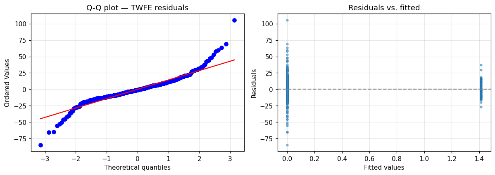

# 04 — Diagnostics (NEW vs. upstream)

> **Tearsheet** for [`notebooks/04_diagnostics.py`](../../notebooks/04_diagnostics.py) · [HTML report](../../site/04_diagnostics.html) · last run `2026-04-19T07:59:27+00:00`

Upstream reports point estimates with no diagnostic accompaniment.
This notebook adds: (a) residual normality + heteroskedasticity tests,
(b) Cook's distance / DFBETAS for influence, (c) leave-one-treated-out
jackknife of the TWFE ATT, (d) block-bootstrap 95% CIs.

**TWFE residual normality tests**

| field | value |
| --- | --- |
| `n` | `816` |
| `mean` | `0` |
| `std` | `14.89` |
| `jarque_bera_stat` | `1644` |
| `jarque_bera_p` | `0` |
| `shapiro_wilk_stat` | `0.9182` |
| `shapiro_wilk_p` | `0` |
| `normality_passes` | `false` |

**Jackknife range across treated districts**

| field | value |
| --- | --- |
| `n_jackknife` | `9` |
| `min_att` | `0.942` |
| `max_att` | `2.042` |
| `median_att` | `1.203` |
| `range` | `1.1` |

**Block bootstrap (B=200, resampling districts)**

| field | value |
| --- | --- |
| `n_replications` | `200` |
| `att_mean` | `1.332` |
| `att_std` | `1.575` |
| `ci_2.5` | `-1.725` |
| `ci_97.5` | `4.243` |

**Continue to** [`05_robustness_and_mechanism.py`](05_robustness_and_mechanism.py)
— heterogeneous treatment effects, placebo test, seasonal-differenced check.

---

*Auto-generated by `jellycell export tearsheet notebooks/04_diagnostics.py`. Regenerating overwrites this file — for hand-authored writeups put a `.md` at the root of `manuscripts/` instead of under `tearsheets/`.*
