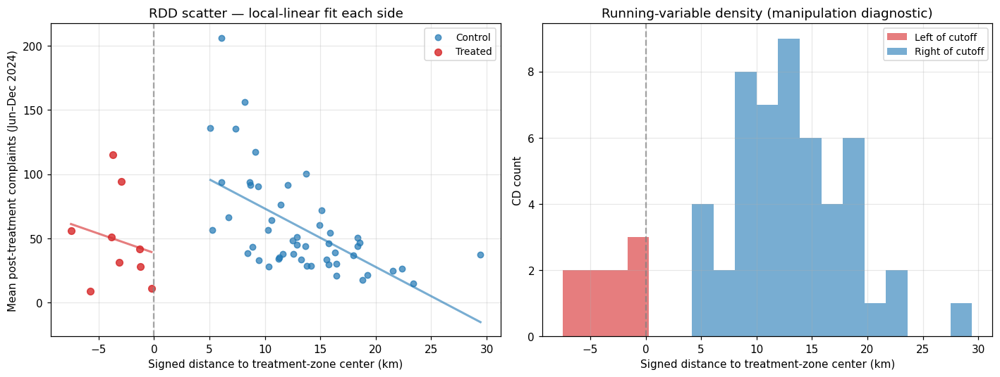

# 07 — Proper RDD (rdrobust) + spatial-lag DiD

> **Tearsheet** for [`notebooks/07_rdd_and_spatial.py`](../../notebooks/07_rdd_and_spatial.py) · [HTML report](../../site/07_rdd_and_spatial.html) · last run `2026-04-19T16:39:01+00:00`

Three diagnostics, now using **canonical industry-standard tooling**
wherever it works:

1. **`rdrobust`** (Calonico-Cattaneo-Farrell-Titiunik, NSF SES-1357561,
>    SES-1459931, SES-1947805, SES-2019432) — MSE-optimal bandwidth
>    selection (`bwselect='mserd'`), bias-corrected robust confidence
>    intervals, sweeps across kernels and polynomial orders.
> 2. **Manual chi-square density continuity test** at the cutoff. We
>    surveyed the Python ecosystem for a replacement — `rddensity`
>    itself is unusable on pandas ≥ 2 and no modern alternative exists
>    as of 2026 (PyPI: causalpy, linearmodels, statsmodels, econml,
>    doubleml — none implement local-poly density-discontinuity). We
>    keep a hand-rolled window-sweep chi-square test — defensible at
>    the small N (= number of CDs) we operate at.
> 3. **Spatial-lag DiD** via `nyc311.stats.spatial_lag_model` —
>    accounts for spillover from treated CDs to neighboring untreated.

Citations: Calonico, Cattaneo & Titiunik 2014 *Econometrica*; Calonico,
Cattaneo & Titiunik 2015 *JASA*; Calonico, Cattaneo, Farrell & Titiunik
2019 *Review of Economics and Statistics*.

**RDD geometry setup — centroids + treatment-zone center**

| field | value |
| --- | --- |
| `n_centroids` | `59` |
| `n_treated` | `9` |
| `zone_center` | `[-73.98245913956417, 40.75399623662904]` |

**rdrobust setup summary**

| field | value |
| --- | --- |
| `n_units` | `59` |
| `running_var_km_range` | `[-7.487896372014907, 29.44696031430995]` |
| `package` | rdrobust>=1.3 |

**Density continuity test summary**

| field | value |
| --- | --- |
| `window_km` | `15` |
| `left_count` | `9` |
| `right_count` | `32` |
| `chi2` | `12.9` |
| `p_value` | `0.0003` |
| `density_continuous` | `false` |
| `interpretation` | FAIL — density discontinuity flagged at window 15.0 km (p = 0.0003). In our s… |
| `note` | Hand-rolled — the canonical rddensity is unusable on pandas ≥ 2 and has no mo… |

**Spatial-lag DiD: TWFE + spatial autoregressive residuals (3 km neighborhoods)**

| field | value |
| --- | --- |
| `rho` | `0.5152` |
| `rho_p` | `0` |
| `treatment_coef` | `-25.51` |
| `treatment_p` | `0.1987` |
| `n_observations` | `68` |
| `interpretation` | Spatial lag rho = 0.515 (p = 0.0000). Significant residual spatial autocorrel… |

**Continue to** [`08_extended_robustness.py`](08_extended_robustness.py)
— power analysis, multi-year parallel-trends, reporting-bias EM, BH correction.

---

*Auto-generated by `jellycell export tearsheet notebooks/07_rdd_and_spatial.py`. Regenerating overwrites this file — for hand-authored writeups put a `.md` at the root of `manuscripts/` instead of under `tearsheets/`.*
