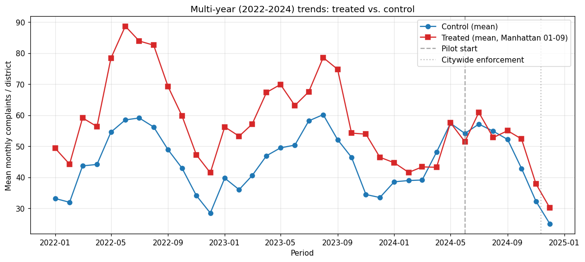

# 08 — Power, multi-year trends, reporting bias, multiple-comparison correction

> **Tearsheet** for [`notebooks/08_extended_robustness.py`](../../notebooks/08_extended_robustness.py) · [HTML report](../../site/08_extended_robustness.html) · last run `2026-04-19T15:42:19+00:00`

The remaining four diagnostics from
[`DIAGNOSTICS_CHECKLIST`](../manuscripts/DIAGNOSTICS_CHECKLIST.md):

1. **MDE power analysis** — what's the smallest effect this design can
   detect at 80% power?
2. **Multi-year parallel-trends test** — using vendored 2022–2024
   Rodent data (3-year window), formal pre-trend regression
3. **Reporting-bias latent EM** — separate true rates from reporting
>    propensities (now plausibly identifiable with 36 months of data)
4. **Benjamini-Hochberg correction** — adjust p-values across the
   full set of hypothesis tests in this showcase

**MDE at default settings: 20.75 complaints (compare to observed ATT)**

| field | value |
| --- | --- |
| `icc` | `0.05` |
| `r_squared` | `0` |
| `mde` | `20.75` |
| `n_units` | `68` |
| `n_periods` | `12` |
| `outcome_variance` | `1911` |
| `proportion_treated` | `0.1324` |

**Multi-year parallel-trends test (2022-May 2024 pre-window)**

| field | value |
| --- | --- |
| `n_pre_periods` | `29` |
| `interaction_coef` | `-0.5785` |
| `interaction_se` | `0.2947` |
| `interaction_p` | `0.0498` |
| `passes` | `false` |
| `interpretation` | FAIL — significant pre-treatment trend differential between treated and control |

**Latent reporting-bias EM (multi-year + demographic covariates)**

| field | value |
| --- | --- |
| `converged` | `true` |
| `n_iterations` | `2` |
| `n_units` | `51` |
| `rho_min` | `0.5` |
| `rho_max` | `0.5` |
| `rho_mean` | `0.5` |
| `rho_std` | `0` |
| `interpretation` | Reporting probabilities collapse to ~uniform — model is underdetermined even … |

**BH correction: 2 → 1 significant tests after FDR control**

| field | value |
| --- | --- |
| `n_tests` | `7` |
| `n_significant_raw` | `2` |
| `n_significant_after_bh` | `1` |
| `method` | Benjamini-Hochberg (fdr_bh) |
| `alpha` | `0.05` |

All seven previously-deferred diagnostics now run. The
[`DIAGNOSTICS_CHECKLIST`](../manuscripts/DIAGNOSTICS_CHECKLIST.md)
is updated accordingly; [`MANUSCRIPT.md`](../manuscripts/MANUSCRIPT.md)
limitations section drops the corresponding bullets.

---

*Auto-generated by `jellycell export tearsheet notebooks/08_extended_robustness.py`. Regenerating overwrites this file — for hand-authored writeups put a `.md` at the root of `manuscripts/` instead of under `tearsheets/`.*
