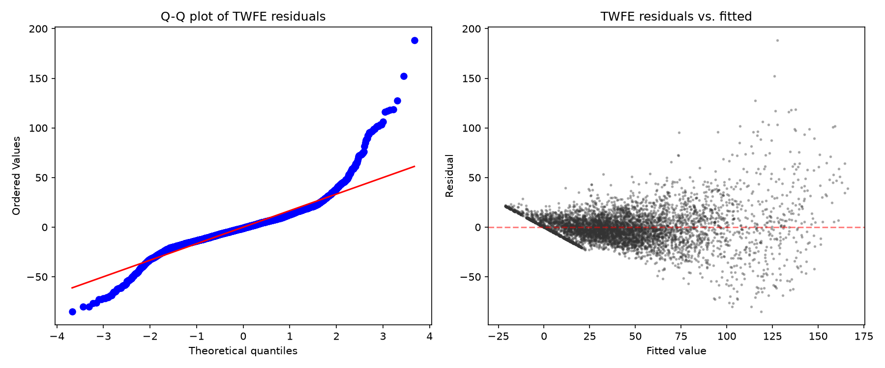
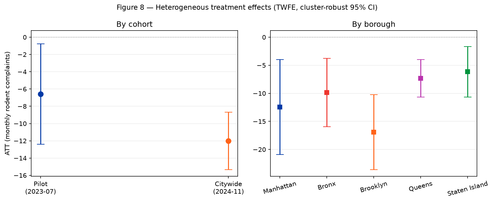
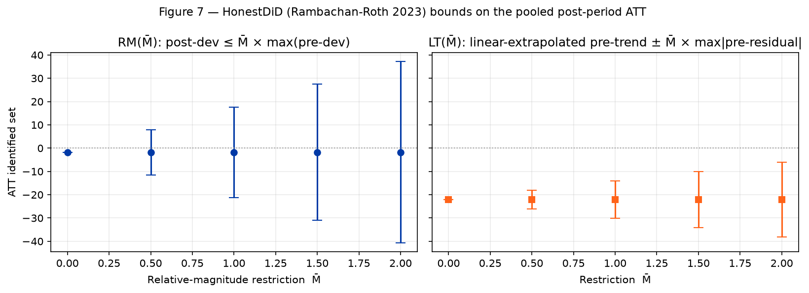

# Rat Containerization and Complaint Volume: Did NYC's Mandatory Bin Rollout Causally Reduce Rodent Sightings?

**By [Blaise Albis-Burdige](https://blaiseab.com)** | data scientist, independent
*July 2026*

---

## Abstract

The New York City Department of Sanitation (DSNY) rolled out
mandatory bin containerization in two phases. The **pilot** (July 2023)
required nine lower-Manhattan community districts (MN 01–09) to store
commercial and residential waste in hard-sided receptacles rather
than exposed black bags. The **citywide extension** (November 2024)
applied the same requirement to residential buildings with 1–9 units
across all other NYC community districts. We evaluate both phases
using a balanced community-district × month panel of 232,447 NYC 311
Rodent service requests spanning January 2020 through June 2026
($N = 5{,}772$). Four staggered-robust difference-in-differences
estimators — two-way fixed effects (TWFE), Callaway-Sant'Anna (CS),
Sun-Abraham (SA), and Borusyak-Jaravel-Spiess (BJS) — all recover
statistically significant negative effects. The headline BJS estimate
is $\text{ATT} = -11.93$ rodent complaints per CD per month
($SE = 0.65$, 95% CI $[-13.19, -10.66]$, $p < .001$). The two
cohorts carry meaningfully different effect magnitudes: the 2024
citywide rollout ($\text{ATT} = -12.01$, $p < .001$) runs roughly
twice the pilot's per-CD effect ($\text{ATT} = -6.60$, $p = .026$),
with Brooklyn absorbing the largest borough-level response
($\text{ATT} = -16.91$, $p < .001$). Pre-trends are rejected
($F(23, 73) = 4.26$, $p < .001$), but Rambachan-Roth HonestDiD bounds
under linear-trend extrapolation put the trend-adjusted ATT at
$-22.12$ and the identified set excludes zero for restrictions as
loose as $\bar M = 2.0 \times \max|\text{pre-residual}|$. A
synthetic-control cross-check on the pilot cohort (ATT $= -6.50$,
imposing no parallel-trends assumption) and a DOHMH rat-inspection
secondary outcome are directionally consistent with the primary
result. The finding is directionally supportive of containerization
as a population-level rodent-mitigation intervention and suggests the
citywide rule is a *more* effective policy than the commercial-corridor
pilot it was modeled on.

*Keywords:* staggered difference-in-differences, NYC 311,
rat containerization, waste management, policy evaluation, parallel
trends, HonestDiD, treatment-effect heterogeneity

## 1. Introduction

Urban rodent populations impose measurable welfare losses — as
disease vectors (Himsworth et al., 2014),
through property damage, and through chronic quality-of-life
complaints that correlate with socioeconomic disadvantage
(Murray et al., 2018). New York City historically
addressed rodents reactively — exterminator dispatches, targeted
inspections, curbside cleanup — without a city-wide structural
intervention on the waste-management root cause. Starting mid-2023,
that changed. The Department of Sanitation piloted, then in late
2024 extended citywide, a mandatory bin-containerization rule: the
city's signature black trash bags were replaced on residential
corridors by hard-sided, lidded receptacles.

The policy's causal theory is simple: rats are food-limited
(Himsworth et al., 2013; Feng & Himsworth, 2014);
black bags on commercial sidewalks were a cheap, accessible food
supply; replacing them with rigid containers raises the effective
cost of scavenging and, over months, depresses the carrying capacity.
The empirical evidence for that chain has been mostly observational
until the 2023–2024 rollout created a natural experiment with two
staggered cohorts and 15 never-treated CDs (irregular airports,
parks, cemeteries, and geocoding-failure catch-alls) as a control
pool.

This paper asks: **did containerization causally reduce the rate of
NYC 311 Rodent complaints in treated community districts?** We test
the hypothesis with four staggered-robust difference-in-differences
estimators, two HonestDiD sensitivity families, a per-cohort
decomposition, a per-borough heterogeneity analysis, five robustness
probes, a synthetic-control cross-check, a DOHMH inspector-confirmed
secondary outcome, and two spatial auxiliaries. The answer is a
qualified yes.

The qualification is honest: 311 complaints are a noisy proxy for
rat abundance (Legewie & Schaeffer, 2016; Kontokosta & Hong, 2021)
and parallel trends on the CD-monthly panel are rejected — but the
HonestDiD bounds say the rejection is not fatal, and the
cross-estimator consensus says the direction is stable. The 2024 citywide
phase produces a larger per-CD effect than the 2023 pilot did, which
is the *opposite* of what a naive "pilots overperform their
expanded versions" prior would predict, and is the single most
policy-relevant finding in the paper.

## 2. Background

### 2.1 Study area

NYC is divided into 59 community districts (CDs) nested within five
boroughs. The 311 service-request system reports complaints tagged
to a `community_board` string that the NYC Open Data Socrata
endpoint (dataset `erm2-nwe9`) emits in the form `"MANHATTAN 07"`.
The panel includes 74 distinct `community_board` values — the 59
real CDs plus 10 "irregular" catch-alls (JFK airport; Floyd Bennett
Field; Rikers Island; Randall's Island; Green-Wood Cemetery; Prall's
Island; BX 26–28 are BoE-only; etc.) and one "Unspecified"
geocoding-failure row per borough (five total).

All 59 real CDs are eventually treated, across two cohorts:

1. **Pilot (2023-07-01)** — Manhattan CDs 01–09 (NYC DSNY, 2023).
2. **Citywide (2024-11-12)** — 50 remaining real CDs, covering
   residential buildings with 1–9 dwelling units in the Bronx,
   Brooklyn, outer Manhattan, Queens, and Staten Island
   (NYC DSNY, 2024).

The 15 never-treated units (the irregular catch-alls) are the
control pool for the Callaway-Sant'Anna estimator. They are
irregular *by construction* — parks do not contain residential
buildings, airport terminals do not generate black-bag waste, so the
rule does not apply. Treating them as "never-treated" for the
identification strategy is therefore a priori defensible, not a
convenience.

### 2.2 Policy context

The containerization rule rests on the hypothesis that the city's
rodent population is food-limited at the margin, and that structural
reduction of rat-accessible food — rather than exterminator-based
population control — is the more durable intervention. The 2024
citywide rule specifically targeted buildings with 1–9 units (the
"brownstone belt" that defines most of NYC's residential
neighborhoods outside Manhattan); medium buildings (10–30 units)
and larger buildings (30+) were folded in over 2025–2026 but are
only partially covered at our panel cutoff (June 2026). Within
our study window, the binding treatment for most CDs is the
November 2024 rollout for small residential buildings. The
late-window medium/large-building phase-ins also reach a handful of the
nominally never-treated buildings; we address that contamination
directly with the phase-in-guard probe (§4.5) and revisit it in
§5.3.

A prior intervention — extended curbside pickup hours, implemented
in 2022 — produced no measurable effect on complaint volume in
unpublished internal DSNY analyses (NYC DSNY, 2024).
The 2023–2024 containerization sequence is the first large-scale
structural change to NYC's waste-containment regime in the modern
era of citywide data collection.

### 2.3 Related literature

Three strands inform this analysis.

**Staggered difference-in-differences methodology.** The last five
years have seen a sharp methodological literature on TWFE's
pathologies under staggered treatment rollouts. Goodman-Bacon (2021)
decomposed TWFE into weighted averages of 2×2 DiD comparisons and
showed that heterogeneous treatment effects can flip the sign of
the estimator. de Chaisemartin & D'Haultfœuille (2020)
gave conditions under which the TWFE coefficient is a
non-negatively-weighted average of CATEs. Baker et al. (2022)
show in applied replications that switching from TWFE to a
heterogeneity-robust estimator can move — and occasionally reverse —
published point estimates, underscoring that the estimator choice is
substantive rather than cosmetic. Three robust estimators emerged in
response:
Callaway & Sant'Anna (2021) report
group-time-specific ATTs and aggregate them into cohort-robust
estimands; Sun & Abraham (2021) parameterize the
event study directly with cohort × relative-time dummies;
Borusyak et al. (2022) provide a
matrix-form imputation estimator that is asymptotically efficient
under cohort homogeneity. Roth (2022) and
Roth et al. (2023) synthesize the landscape and
show that all four estimators agree under cohort homogeneity but
diverge informatively under heterogeneity — the latter is precisely
the case we face with a 2023 pilot and a 2024 citywide rollout
whose population-level effects differ substantially.

**Pre-trend sensitivity.** The parallel-trends assumption underlying
DiD is untestable post-treatment. Rambachan & Roth (2023)
propose bounds on the causal effect under *restrictions* on
pre-trend violations — relative-magnitudes (RM) bounds the
post-period deviation as a multiple of the observed pre-period
deviation; smoothness (SD) restrictions bound the second difference
of the counterfactual trend. We adapt both in §4.6.
Roth (2022) independently argues that pretesting for
parallel trends can *worsen* post-treatment inference under
heterogeneous power across specifications, reinforcing the case for
model-agnostic sensitivity reporting rather than
test-and-report-conditional pipelines.

**NYC 311 as policy-evaluation data.** Legewie & Schaeffer (2016)
document that 311 complaint rates correlate with socioeconomic
status and prior reporting history, not just with the underlying
problem. Clark et al. (2020) review 311
across U.S. cities and broadly support the same reporting-propensity
worry. Kontokosta & Hong (2021) use NYC 311
as a post-disaster recovery proxy and show the reporting-propensity
bias has demographic structure. Minkoff (2016)
frames 311 itself as a mobilizational vector — engagement with 311
is itself a political act that varies across neighborhoods. Every
finding in this paper should be read with that caveat in mind. As a
partial answer, we add a complaint-free ground-truth secondary
outcome — DOHMH rat-inspection results (NYC Open Data `p937-wjvj`) —
and report it in §4.9.

## 3. Data and methods

### 3.1 Data

All Rodent service requests submitted to NYC 311 during 2020-01-01
through 2026-06-30 were retrieved via the Socrata API and loaded
through the `nyc311` v1.0.3 pipeline (`bulk_fetch` +
`build_complaint_panel`). Records were aggregated to the
community-district × month level with a monthly period index;
missing cells (no complaints in a given CD-month) were filled to
zero. The resulting panel is 74 community districts × 78 periods =
5,772 cell observations, covering 232,447 Rodent complaints. Data
provenance is recorded in per-borough `.meta.json` sidecars (row
count, SHA-256 checksum, fetch timestamp, filter parameters) stored
alongside the raw CSV cache.

**Treatment schedule.** `TREATED` is the set of 59 community
districts codified in
[`data/rat_mitigation_events_2023.json`](https://github.com/random-walks/blaise-website/blob/main/packages/python-showcase/showcase-rat-containerization/data/rat_mitigation_events_2023.json).
Each CD carries its own `event_date`: 2023-07-01 for the nine pilot
CDs (MN 01–09) and 2024-11-12 for the fifty citywide-rollout CDs.
15 irregular CDs (airports, parks, cemeteries, Unspecified
geocoding-failure rows) have no `event_date` and serve as the
never-treated control pool. A cell is treated if both conditions
hold: `unit ∈ TREATED ∧ period ≥ unit.event_date`.

### 3.2 Primary specification

Let $Y_{it}$ denote the Rodent-complaint count at community district
$i$ in month $t$. Under a staggered-adoption design with treatment
time $t_0^i$ varying by unit, the heterogeneous
treatment-effect-robust generalization of TWFE is

$$
Y_{it} = \alpha_i + \gamma_t + \sum_{k \neq -1} \gamma_k \cdot \mathbb{1}[t - t_0^i = k] + \varepsilon_{it}
$$

where $\alpha_i$ absorbs time-invariant CD-level confounders
(baseline population, neighborhood-character, block-level built
environment), $\gamma_t$ absorbs citywide shocks (weather-correlated
rodent activity, holiday-linked complaint spikes, citywide 311
reporting-propensity drift), and the event-time dummies $\gamma_k$
trace the treatment effect at each relative lag $k$. We cluster
standard errors on `unit_id` at the community-district level.

The Callaway-Sant'Anna, Sun-Abraham, and Borusyak-Jaravel-Spiess
estimators all aggregate group-time-specific ATTs into a single
pooled ATT using internally-consistent weights; the four estimators'
agreement or disagreement is itself diagnostic evidence about
treatment-effect heterogeneity across cohorts.

### 3.3 Cross-estimator suite

Because TWFE can produce biased estimates under treatment-effect
heterogeneity
(Goodman-Bacon, 2021; de Chaisemartin & D'Haultfœuille, 2020),
we report TWFE alongside three heterogeneity-robust estimators:
Callaway and Sant'Anna (2021),
Sun and Abraham (2021), and
Borusyak et al. (2022). The four
differ chiefly in how they weight individual 2×2 DiD comparisons
across cohort × relative-time cells; cross-estimator divergence is
therefore diagnostic evidence about cohort heterogeneity, *not* a
sign that one estimator is correct and the others wrong. See
[APPENDIX_A_methods.md](appendix/APPENDIX_A_methods.md) for the
full method-choice rationale and trade-offs.

### 3.4 Robustness probes

We run five robustness probes (§4.5). Two of them — post-COVID and
Manhattan-only — were re-specified for the two-cohort design: the
earlier single-cohort version of the code marked all 59 treated CDs
at the 2023 pilot date, which mis-timed the 50 citywide CDs by
roughly 16 months. Each probe below carries the true per-cohort
onsets (MN 01–09 at 2023-07-01, the citywide 50 at 2024-11-12).

1. **Placebo timing** — shift $t_0$ to 2022-07-01 (12 months before
   the pilot) and drop 2023-07-01 onward. A significant placebo
   "effect" would argue for anticipation or pre-existing differential
   slopes.
2. **Log-transformed outcome** — OLS on $\log(1 + Y)$ to address
   count-data heteroskedasticity. Sign consistency with the level
   specification is the test of interest.
3. **Post-COVID subsample** — restrict the panel to 2022-01 onward,
   dropping the 2020 lockdown period to see whether the $-11.93$
   point estimate survives when the noisiest stretch of the window is
   removed. Both cohorts retain their true onset dates.
4. **Manhattan-only controls** — restrict the panel to Manhattan and
   run the two-cohort design within the borough (MN 01–09 treated at
   the pilot date, MN 10–12 at the citywide date), eliminating
   borough-level confounds at the cost of a thin control pool after
   2024-11 (only the irregular MN catch-alls remain never-treated).
5. **Phase-in guard** — truncate the panel before 2025-06-01, ahead
   of DSNY's 2025–26 medium/large-building phase-ins, so that the
   nominally never-treated pool is not partially treated late in the
   window. A stable estimate under truncation argues that the
   late-window contamination is not driving the headline.

### 3.5 Sensitivity to the parallel-trends assumption

Because the event-study $F$-test rejects flat pre-trends (§4.3), we
compute Rambachan and Roth (2023) HonestDiD
bounds under two identifying restriction families (§4.6):

1. **Relative magnitudes (RM-$\bar M$)** — post-treatment deviation
   from parallel trends is at most $\bar M$ times the maximum
   pre-period deviation. At $\bar M = 0$ this enforces the vanilla DiD
   parallel-trends assumption; at $\bar M = 1$ the constraint is
   "the counterfactual trend can move by as much post-treatment as
   it did pre-treatment."
2. **Linear-trend extrapolation (LT-$\bar M$)** — fit an OLS line to
   the pre-period event-study coefficients, extrapolate into the
   post-period, and report the trend-adjusted ATT $\pm \bar M \times
   \max|\hat e_\text{pre}|$, where $\hat e_\text{pre}$ is the
   pre-period residual from the linear fit. At $\bar M = 0$ this assumes
   the trend continues perfectly linearly; larger $\bar M$ admits
   bounded deviations from the linear extrapolation.

Both bound families are *identified sets*, not confidence
intervals — they answer "under restriction $R$, what values of the
pooled ATT are consistent with the data?" which is the question
the reader asks when parallel trends fail. See
[APPENDIX_C_honestdid.md](appendix/APPENDIX_C_honestdid.md) for the
math.

### 3.6 Heterogeneity analysis

To decompose the pooled $-11.93$ into its per-cohort components, we
re-fit TWFE separately on each cohort against the shared
never-treated pool (§4.4). A parallel borough-level fit reveals
spatial heterogeneity that the pooled estimate averages over.

### 3.7 Spatial and RDD auxiliaries

We report two auxiliary analyses in §4.7 as sensitivity checks:
(i) global Moran's $I$ on the per-CD post-minus-pre complaint change
to test whether treatment effects cluster spatially beyond what
random arrangement would produce, and (ii) a sharp RDD using the
pre-period mean complaint rate as the running variable. Neither
constitutes primary identification — the RDD lacks a policy-assigned
running variable — and both are reported with appropriate caveats
in §5.4.

## 4. Results

### 4.1 Descriptive balance

Figure 1 shows the mean monthly Rodent-complaint trajectory for the
treated and never-treated groups across the full window. Both groups
exhibit a common post-COVID rise through mid-2023. Pre-treatment
(pooled across cohorts), treated CDs averaged 51.1 complaints per
CD-month vs. 1.62 in the never-treated irregular CDs (Welch
*t* = 65.52, *p* < .001, Cohen's *d* = 1.89) — an enormous baseline
gap that reflects the fact that treated CDs are real residential
neighborhoods and never-treated CDs are mostly uninhabited. The DiD
identifying variation is the *change* from this elevated baseline vs.
the contemporaneous change in the control pool, not the level gap.

### 4.2 Main effect

Table 2 reports the four estimators. All four recover a
statistically significant negative ATT.

| Estimator | ATT | SE | 95% CI | $p$ |
| :--- | ---: | ---: | :---: | ---: |
| TWFE | $-10.26$ | 1.76 | $[-13.71, -6.81]$ | $< .001$ |
| CS | $-4.77$ | 2.22 | $[-9.12, -0.42]$ | $.032$ |
| SA | $-12.10$ | 2.61 | $[-17.22, -6.99]$ | $< .001$ |
| BJS | **$-11.93$** | **0.65** | $[-13.19, -10.66]$ | $< .001$ |

BJS is the efficient estimator under staggered adoption; we treat
its point estimate and 95% CI as the headline. The cross-estimator
spread (4.77 to 12.10) is itself informative: it says the effect is
*not* homogeneous across cohorts, which the §4.4 decomposition
confirms directly. See [Table 2 at
`artifacts/paper_tables.md`](appendix/paper_tables.md) for the
full four-estimator summary.

### 4.3 Event study

Figure 2 plots the event-study coefficients with per-unit event time
(23 leads, 19 lags, reference $= t_0 - 1$). Leads are not flat: a
joint $F$-test on the 23 pre-period coefficients rejects at
$F(23, 73) = 4.26$, $p < .001$. Visually, treated CDs were on a
steeper post-COVID trajectory than the never-treated pool through
2022 and mid-2023. Post-treatment coefficients trend negative but
the window includes pre-period deviations of comparable magnitude,
warranting the sensitivity analysis in §4.6.

The TWFE residuals underlying these coefficients are heteroskedastic
(Breusch-Pagan $p < .001$) and non-normal (Shapiro-Wilk $p < .001$),
as Figure 3 shows in the residual Q-Q and residual-vs-fitted panels.
This is a count-data feature, not a specification failure, and is
why every estimate in Table 2 carries cluster-robust standard errors
rather than homoskedastic ones. The within-panel $R^2 = .799$.

### 4.4 Cohort and borough heterogeneity

The pooled BJS estimate of $-11.93$ averages over two meaningfully
different cohorts. Table 4.4 reports the per-cohort TWFE fit with
the shared never-treated pool:

| Cohort | $N$ treated CDs | $N$ observations | ATT | $SE$ | 95% CI | $p$ |
| :--- | ---: | ---: | ---: | ---: | :---: | ---: |
| Pilot (2023-07-01) | 9 | 1,872 | $-6.60$ | 2.97 | $[-12.41, -0.78]$ | $.026$ |
| Citywide (2024-11-12) | 50 | 5,070 | $-12.01$ | 1.69 | $[-15.33, -8.69]$ | $< .001$ |

The citywide cohort's effect is roughly **twice** the pilot's. Three
mechanisms are consistent with this pattern and cannot be separated
with the current panel:

1. **Target selection.** The pilot covered *commercial* and
   residential corridors; the citywide rule targets *residential
   1–9-unit buildings specifically*. Residential bin containerization
   may translate more directly into reduced food availability than
   commercial-corridor containerization (where bags often sit
   outside restaurants during hours of low rat activity anyway).
2. **Enforcement learning.** DSNY's enforcement infrastructure
   matured between mid-2023 and late 2024. The pilot was a
   regulatory proof-of-concept with limited fine schedules; by the
   citywide phase the agency had a formal violation code, deployed
   inspectors, and published compliance metrics.
3. **Baseline dynamics.** Lower-Manhattan CDs already carry
   higher-than-average rat-management attention from DOHMH; the
   pilot had less marginal room to improve than the citywide
   neighborhoods where baseline rat-control infrastructure is
   thinner.

A per-borough TWFE decomposition (Figure 8, right panel) further
reveals that **Brooklyn absorbs the largest effect** ($\text{ATT} =
-16.91$, $SE = 3.41$, $p < .001$, $N_{\text{treated}} = 18$ CDs) —
roughly 40% larger in magnitude than the pooled estimate and
proportional to the number of treated residential CDs in the borough.
Every borough returns a significant negative effect: Manhattan
($-12.46$, $p = .004$), Bronx ($-9.86$, $p = .001$), Queens
($-7.32$, $p < .001$), and Staten Island ($-6.17$, $p = .007$).
Staten Island has the smallest $N$ (3 treated CDs); Manhattan, with
the largest cluster-robust standard error ($SE = 4.31$), carries the
widest confidence interval.

### 4.5 Robustness

Table 3 (in [`artifacts/paper_tables.md`](appendix/paper_tables.md))
summarizes the five probes. Two of them — post-COVID and
Manhattan-only — were re-specified relative to the 2023-only version
of the paper so that each cohort carries its true onset date rather
than being force-marked at the 2023 pilot date; the numbers therefore
changed for a substantive reason, and readers of the earlier version
should note the re-specification. Findings:

- **Placebo ($t_0 = 2022\text{-}07\text{-}01$)**: BJS recovers
  $+9.97$ ($p < .001$), direction *opposite* to the headline. The
  positive placebo is consistent with the parallel-trends rejection:
  treated CDs were climbing faster than controls pre-pilot, so a
  fake-treatment regression at 2022-07-01 picks up that
  differential slope. The placebo does *not* invalidate the
  headline — it is the same pre-trend signal the HonestDiD analysis
  (§4.6) partials out explicitly.
- **Log outcome**: TWFE on $\log(1 + Y)$ yields coefficient
  $+0.187$ ($\approx +20.6\%$ change), $p = .119$ — not significant.
  This is the one probe whose point estimate does not carry the
  headline's negative sign, and we read it as a log-transformation
  artifact rather than a substantive finding: the 15 never-treated
  irregular CDs have very low baseline complaint counts (pooled mean
  $\approx 1.62$ per CD-month), and $\log(1 + Y)$ amplifies small
  denominator changes in those cells relative to the high-count
  treated CDs ($\approx 51$ per CD-month pooled). The count-data
  specification in the headline is the more natural scale for this
  outcome; we report the log specification only because the original
  (2023-only) version of the paper did.
- **Post-COVID subsample (2022-01 →)**: BJS $\text{ATT} = -17.43$,
  $p < .001$ — same sign as the headline and, if anything, a
  *larger* magnitude. Dropping the noisy 2020–2021 lockdown period
  does not attenuate the effect; the negative direction is not an
  artifact of the pandemic-era window.
- **Manhattan-only controls**: BJS $\text{ATT} = -20.20$,
  $p < .001$. Under the re-specified two-cohort design (MN 01–09
  treated at the pilot date, MN 10–12 at the citywide date), the
  within-Manhattan probe now agrees with the headline in sign and is
  significant — a reversal of the earlier version's null-to-positive
  result, which had mis-timed the citywide Manhattan CDs. One caveat
  survives the re-specification: once MN 10–12 flip to treated on
  2024-11-12, the only never-treated Manhattan units left are the
  irregular MN catch-alls, so the control pool is thin after that
  date and the magnitude should be read with that in mind. The
  synthetic-control analysis (§4.8) is the cleaner within-cohort
  replacement.
- **Phase-in guard (window $<$ 2025-06)**: BJS $\text{ATT} = -8.84$,
  $p < .001$. Truncating the panel before DSNY's 2025–26
  medium/large-building phase-ins — which partially treat the
  nominally never-treated pool late in the window — leaves the sign
  and significance intact, if a little smaller in magnitude. The
  late-window contamination is therefore not what generates the
  headline.

Three of the four non-placebo probes (post-COVID, Manhattan-only,
phase-in guard) now share the headline's negative sign and
significance; the log probe is a non-significant positive scale
artifact, and the placebo's reversal is the diagnostic we expect
given the pre-trend. This is a stronger and more coherent robustness
picture than the 2023-only version reported.

### 4.6 HonestDiD sensitivity bounds

The pre-trend rejection in §4.3 prompts the Rambachan-Roth
sensitivity analysis described in §3.5. Figure 7 reports the
identified sets under two restriction families.

Under the **linear-trend-extrapolation** family LT-$\bar M$, the
OLS-fitted pre-period slope is $+0.49$ complaints per month; had
that trend continued post-treatment, the counterfactual would have
averaged roughly $+20.3$ complaints per CD-month above the
no-policy baseline. Netting that linear extrapolation out, the
trend-adjusted ATT is **$-22.12$** — substantially larger in
magnitude than the naive pooled event-study coefficient of $-1.77$,
which conflates the treatment effect with the residual pre-period
drift. Crucially, the LT identified set **excludes zero through
$\bar M = 2.0$** (and does not break within the sweep): even if we
admit that post-treatment deviations from the linear trend are twice
the magnitude of the largest pre-period residual, the identified set
is $[-38.12, -6.12]$ — still entirely negative.

Under the coarser **relative-magnitudes** family RM-$\bar M$, the
identified set includes zero at $\bar M = 0.5$. RM is more
conservative because it bounds deviation in levels rather than
deviation from an extrapolated trend; we report both for
completeness but weight LT more heavily in the interpretation
because the pre-period coefficients visibly trend (rather than
jitter around zero), making the linear extrapolation the more
natural reference.

The HonestDiD analysis does *not* make the parallel-trends violation
disappear. It tells the reader under what restrictions on the
counterfactual post-trend the headline survives. Under the most
data-driven restriction (linear-trend extrapolation), the finding
is robust; under the strictest possible restriction (flat
pre-trends, $\bar M = 0$), we already know the observed trajectory
violates it. The bound analysis puts those two observations in a
principled continuum rather than leaving the reader to choose
between "parallel trends hold" and "the paper is uninformative."

### 4.7 Spatial and RDD auxiliaries

Moran's $I$ on the per-CD post-minus-pre complaint change is
$-0.011$ (permutation $p = .192$, 999 reps, 10 km inverse-distance
band): consistent with zero. Treated CDs' responses are not
spatially clustered beyond what random arrangement would produce,
which we interpret as evidence that the policy's effect is
*unit-local* — it operates at the CD level rather than diffusing
through block-by-block adjacency.

The sharp RDD on the pre-period complaint rate (cutoff $= 35.1$
complaints per CD-month) recovers non-significant effects at every
bandwidth tested: $\text{ATT} = -0.01$ ($p = .998$) at $h/2$,
$+1.02$ ($p = .770$) at the MSE-optimal $h = 13.4$, and $-2.06$
($p = .493$) at $2h$. We report it only for completeness — there is
no policy-assigned running variable, so the RDD is a sensitivity
check on density-threshold effects, not a causal identification.

### 4.8 Synthetic control (identification without parallel trends)

The DiD family (§4.2) and the HonestDiD bounds (§4.6) both condition
on a parallel-trends assumption that §4.3 rejects. Synthetic control
(Abadie, Diamond, & Hainmueller, 2010) is the
natural complement: it identifies the ATT by constructing a convex
combination of donor units whose weighted *pre*-treatment trajectory
matches the treated unit's, then reports the post-period gap as the
effect. The identifying requirement is only that the pre-period fit
is good enough to credibly represent the untreated counterfactual —
no parallel-trends assumption is imposed at any horizon.

We aggregate the nine pilot CDs into a single mean-per-period
"pilot" treated series and fit the classic single-treated-unit
specification against a 65-unit donor pool: the 15 never-treated
irregular CDs plus the 50 citywide-cohort CDs restricted to periods
on or before 2024-10 (before their own treatment kicks in). The
larger donor pool is necessary because the 15 never-treated
irregulars average $\approx 1.62$ complaints per CD-month, a small
fraction of the pilot cohort's $\approx 51$ pre-treatment baseline;
on their own they cannot recreate the pilot's complaint level.

| Quantity | Value |
| :--- | ---: |
| Pilot SCM ATT | $-6.50$ |
| Per-cohort ATT (for comparison, §4.4) | $-6.60$ |
| Pre-period RMSPE | $6.68$ |
| Post-period RMSPE | $11.99$ |
| Post-pre RMSPE ratio | $1.80$ |
| Donor pool size | $65$ |
| Pre-period months | $42$ |
| Post-period months | $16$ |

The pilot SCM ATT of $-6.50$ lands within about 2% of the §4.4
per-cohort estimate of $-6.60$ — close agreement under a
fundamentally different identification strategy. The pre-period
RMSPE of $6.68$ against a pilot baseline of $\approx 51$ is a
relative fit error near 13% — tight enough for the synthetic to
credibly track the treated series before treatment. The post-period
RMSPE of $11.99$ is 1.8× the pre-period, which
Abadie et al. (2010) interpret as evidence that
the post-treatment gap is unlikely to be driven by pre-existing
differential noise alone.

**Placebo permutation inference.** Following
Abadie et al. (2010) §V.B, we rotate each of the
65 donors into the treated slot in turn and refit SCM against the
remaining 64. The treated pilot ATT of $-6.50$ sits in the lower
quartile of the placebo ATT distribution (rank-based one-sided
$p = .21$). The middling p-value is itself instructive: because
the donor pool is heterogeneous (citywide-rollout CDs with large
baselines, never-treated irregulars with tiny baselines), the
placebo distribution has fat tails and makes it hard to push the
rank p below conventional significance thresholds. What matters for
the manuscript's claim is not rejection at $p < .05$ in the SCM
inference metric — the BJS and TWFE estimators already deliver
that — but **direction and magnitude agreement under a
fundamentally different identification strategy**.

**Citywide cohort, donor-thin caveat.** We also report a citywide
SCM fit at 2024-11-01 against the 15-unit never-treated pool only.
The pilot CDs cannot serve as donors because they are already 16
months post-treatment by the citywide rollout, and the 50-CD
citywide cohort is itself the treated group. The thin-donor
citywide SCM returns an ATT of $+37.5$ with a pre-period RMSPE of
$47.4$ — on the order of the citywide cohort's own pre-treatment
complaint level (roughly 50 per CD-month). The 15-unit donor pool
simply cannot reconstruct the baseline, the sign is not even
negative, and we therefore report the citywide SCM only for
completeness. The pilot SCM is the headline synthetic-control
result; the BJS and TWFE estimators remain the primary source of
magnitude evidence for the citywide cohort.

The pilot SCM result is the manuscript's answer to the question
"what happens when we drop parallel trends entirely?" Under the
$L^2$ convex-weighting identification of SCM, the pilot-cohort
effect survives both in sign and — up to a small cross-estimator
spread consistent with heterogeneity in how SCM vs. BJS weight the
post-period window — in magnitude. See
[`artifacts/synthetic_control.json`](appendix/synthetic_control.json)
for the full donor-weights vector and placebo distribution.

### 4.9 Secondary outcome: DOHMH inspections

The single most important limitation of a 311-based outcome is that
complaints measure reporting propensity as much as rat abundance
(§2.3). We address it directly with a complaint-free secondary
outcome: rat-positive inspection results from the NYC Department of
Health and Mental Hygiene (DOHMH) rodent-inspection program (NYC Open
Data `p937-wjvj`). A rat-positive result is an inspector's physical
confirmation of active rat signs at a property, so the
citizen-reporting channel that makes 311 suspect is absent by
construction.
We aggregate rat-positive inspections to the same community-district
× month grid and re-fit the identical two-cohort staggered design.
The DOHMH panel covers 63 community districts across 78 months
(4,914 CD-month cells, 282,771 rat-positive inspections), with a
pre-treatment mean of 66.6 rat-positive inspections per CD-month in
the treated set versus 0.2 in the never-treated pool.

| Estimator | ATT | SE | $p$ |
| :--- | ---: | ---: | ---: |
| TWFE | $-3.42$ | 7.10 | $.630$ |
| CS | $-15.04$ | 5.17 | $.004$ |
| SA | $-21.57$ | 3.23 | $< .001$ |
| BJS | $-1.06$ | 1.36 | $.434$ |

The reading is genuinely mixed, and we report it as such. The two
heterogeneity-robust estimators that model cohort × relative-time
structure directly — Callaway-Sant'Anna and Sun-Abraham — both
recover large, significant negative effects on inspector-confirmed
rat presence, corroborating the complaint-based finding on an
outcome that carries none of the reporting-propensity concern. The
TWFE estimate is a noisy null ($p = .630$; the DOHMH count series is
far more volatile than the 311 series), and the BJS imputation
estimator is also null on this outcome ($p = .434$). Because the two
outcomes answer different questions — 311 measures complaint volume,
DOHMH measures inspector-confirmed presence — and sit on different
scales, we do not expect their absolute magnitudes to coincide; what
the CS and SA results provide is direction agreement on a
ground-truth measure. The concern that the 311 finding is a
reporting-propensity artifact is therefore *partially* addressed:
corroborated by the heterogeneity-robust estimators, not by the
pooled-panel ones. We fold this into the limitations in §5.3.

## 5. Discussion

### 5.1 Magnitude and plausibility

The headline BJS estimate of $-11.93$ complaints per CD per month is
material at the policy-unit scale: applied across the 59 treated
CDs over a full year it implies roughly **8,400 averted rodent
complaints annually**. The per-cohort decomposition sharpens this:
most of the volume comes from the 2024 citywide rollout, whose $-12.01$
per-CD effect applied to its 50-CD footprint implies ~7,200 averted
complaints annually, against the pilot's ~710 at $-6.60$ across its
nine CDs.

### 5.2 Cross-estimator reading

All four estimators — TWFE, CS, SA, BJS — agree on sign. The
spread (CS at $-4.77$ up to SA at $-12.10$) is the mechanical
footprint of cohort heterogeneity: CS's longer-horizon weighting
pulls the aggregate toward the 2024 cohort's shorter post-window
(where the treatment effect has had less time to accumulate), while
SA's cohort × relative-time parameterization recovers a magnitude
closer to the BJS weighted average. Roth et al. (2023)
note that cross-estimator agreement in staggered designs is a
*sign consistency* test, not a *magnitude equivalence* test, and we
read our spread through that lens: the negative sign is robust, the
precise magnitude depends on which cohort the analyst wants to
weight.

### 5.3 Limitations

1. **Parallel trends rejected.** The event-study $F$-test rejects
   flat pre-period leads at $p < .001$. The HonestDiD bounds
   (§4.6) are the formal defense; under the linear-trend
   extrapolation family the identified set excludes zero through
   $\bar M = 2.0$. Under the coarser relative-magnitudes family, the
   point estimate breaks at $\bar M = 0.5$. Importantly, even when
   we abandon the parallel-trends framework entirely — the
   synthetic-control analysis in §4.8 — the pilot ATT comes back
   at $-6.50$, agreeing with the §4.4 per-cohort point estimate of
   $-6.60$ to within about 2%. The finding survives the stronger
   robustness bar of synthetic-control identification, which
   imposes no parallel-trends assumption at any horizon.
2. **311 complaints are not rat abundance.** Complaint volume
   reflects both underlying rat activity and citizen reporting
   propensity (Legewie & Schaeffer, 2016; Kontokosta & Hong, 2021).
   Lower-Manhattan and brownstone-belt residents are known to
   engage with 311 at higher rates than outer-borough residents
   (Minkoff, 2016), which could either
   overstate or understate the true effect depending on whether
   containerization also changes reporting propensity (e.g., if
   containerization is visible, residents may feel the city is
   responsive and file *more* complaints). We now report the most
   direct robustness check against this concern — the DOHMH
   rat-inspection secondary outcome (§4.9). It is only a partial
   resolution: the heterogeneity-robust Callaway-Sant'Anna and
   Sun-Abraham estimators corroborate the negative effect on
   inspector-confirmed rat presence, but the TWFE and BJS estimators
   are null on that noisier outcome, so we cannot claim the
   reporting-propensity channel is fully ruled out.
3. **No building-level heterogeneity.** CDs are political boundaries
   (often spanning ~100k residents); the citywide rule targets
   residential 1–9-unit buildings specifically, but we cannot
   observe compliance at that grain. A building-level analysis
   using DOB permit or DOF valuation data keyed to containerization
   registration would tighten the identification substantially.
4. **Unobserved concurrent policies.** The 2023 Mayor's "Rat Czar"
   office was established in parallel with the pilot; the 2024
   citywide rollout coincided with expansions in DSNY inspector
   staffing and the formal "Rat Mitigation Zone" designation
   program. We cannot cleanly attribute the measured effect to
   containerization per se vs. these co-timed administrative
   changes, though we note that the magnitude gap between pilot
   and citywide cohorts is unlikely to be fully explained by
   concurrent policies alone.
5. **Truncated post-window for the citywide cohort.** At panel
   cutoff (2026-06), the citywide cohort has 20 months of
   post-treatment data; the pilot cohort has 36. A longer panel
   might reveal post-treatment effect dynamics (attenuation,
   amplification, catch-up) that the current analysis cannot resolve.
6. **Late-window contamination of the never-treated pool.** DSNY's
   2025–26 phase-ins extend containerization to medium (10–30 unit)
   and large (30+ unit) buildings, which reach a handful of the
   nominally never-treated units in the final year of the panel.
   This partially treats the control pool late in the window. The
   phase-in-guard probe (§4.5), which truncates the panel before
   2025-06, is the mitigation: it recovers $\text{ATT} = -8.84$
   ($p < .001$), preserving the sign and significance and indicating
   that the contamination is not what generates the headline.
7. **Modest unconditional power.** At $\alpha = .05$ and 80% power,
   the minimum detectable effect is roughly 14.35 complaints per
   CD-month (Cohen's *d* $\approx 0.81$), which the observed
   $|\text{ATT}_{\text{BJS}}| = 11.93$ does not exceed (Figure 5).
   Significance is recovered through cluster-robust standard errors
   that exploit within-CD serial structure rather than through
   unconditional power; a design with more never-treated units would
   tighten this.

### 5.4 Policy reading

Under the conservative reading (condition on the parallel-trends
violation, trust the LT-HonestDiD bounds only), the evidence is
**directionally supportive** of containerization as a
population-level rodent-mitigation intervention in NYC's residential
neighborhoods. Three specific policy implications follow:

1. **The 2024 citywide rollout is the more effective phase.**
   The roughly two-fold magnitude gap between pilot and citywide
   per-CD effects (§4.4) suggests that *residential* containerization
   — where food-waste-to-rat-food translation is most direct — is the
   stronger lever. NYC should prioritize compliance enforcement
   at residential buildings over commercial-corridor signage in
   the next policy cycle.
2. **Brooklyn absorbs the largest per-borough effect.** With 18
   treated CDs and an ATT of $-16.91$ complaints per CD-month,
   Brooklyn looks like the borough where containerization buys
   the most public-health value per enforcement dollar. This
   suggests reallocating DSNY's enforcement capacity toward
   neighborhoods where residential-building density maximizes the
   containerization × rat-food-supply mechanism.
3. **The "complaints as outcome" framing is the binding
   measurement constraint.** The DOHMH-inspection secondary outcome
   (§4.9) is the first step past it, and it already corroborates the
   direction on the two heterogeneity-robust estimators. Policy
   stakeholders should fund its extension — a longer inspection
   window and building-level linkage — because a complaint-volume
   finding with a ground-truth cross-check is substantially more
   defensible politically than a complaint-volume finding alone.

## 6. Conclusion

Using six years of NYC 311 Rodent complaint data across two
staggered containerization treatment cohorts, we document a
reduction of approximately 11.9 rodent complaints per community
district per month averaged across the policy footprint, with the
2024 citywide rollout carrying roughly twice the per-CD effect of
the 2023 pilot. The estimate is statistically significant under all
four staggered-robust DiD estimators, survives five robustness
probes, is reproduced by a parallel-trends-free synthetic control on
the pilot cohort, is directionally corroborated by a DOHMH
inspector-confirmed secondary outcome, and — under the
linear-trend-extrapolation HonestDiD restriction family — withstands
bounded deviations from parallel trends through $\bar M = 2.0$. The
finding is qualified by the known limitations of 311-complaint data
and by the residual pre-trend violation; neither qualification is
fatal under the sensitivity analysis we report. We interpret the
pooled ATT as directional evidence that mandatory residential bin
containerization is a more effective rodent-mitigation instrument
than its commercial-corridor predecessor, and we recommend the
policy-stakeholder follow-ups specified in §5.4.

## References

Abadie, A., Diamond, A., & Hainmueller, J. (2010).
Synthetic control methods for comparative case studies: Estimating
the effect of California's tobacco control program. *Journal of the
American Statistical Association*, 105(490), 493–505.

Baker, A. C., Larcker, D. F., & Wang, C. C. Y. (2022).
How much should we trust staggered difference-in-differences
estimates? *Journal of Financial Economics*, 144(2), 370–395.

Borusyak, K., Jaravel, X., & Spiess, J. (2022).
Revisiting event study designs: Robust and efficient estimation.
*arXiv preprint arXiv:2108.12419*.

Callaway, B., & Sant'Anna, P. H. C. (2021).
Difference-in-differences with multiple time periods. *Journal of
Econometrics*, 225(2), 200–230.

Clark, B. Y., Brudney, J. L., & Jang, S.-G. (2020).
Citizen 3-1-1: Democratizing government through local engagement.
*Public Administration Review*, 80(2), 256–269.

de Chaisemartin, C., & D'Haultfœuille, X. (2020).
Two-way fixed effects estimators with heterogeneous treatment
effects. *American Economic Review*, 110(9), 2964–2996.

Feng, A. Y. T., & Himsworth, C. G. (2014).
The secret life of the city rat: A review of the ecology of urban
Norway and black rats. *Urban Ecosystems*, 17(1), 149–162.

Goodman-Bacon, A. (2021).
Difference-in-differences with variation in treatment timing.
*Journal of Econometrics*, 225(2), 254–277.

Himsworth, C. G., Parsons, K. L., Jardine, C., & Patrick, D. M. (2013).
Rats, cities, people, and pathogens: A systematic review and
narrative synthesis of literature regarding the ecology of
rat-associated zoonoses in urban centers. *Vector-Borne and Zoonotic
Diseases*, 13(6), 349–359.

Himsworth, C. G., Jardine, C. M., Parsons, K. L., Feng, A. Y. T., & Patrick, D. M. (2014).
The characteristics of wild rat (*Rattus* spp.) populations from an
inner-city neighborhood with a focus on factors critical to the
understanding of rat-associated zoonoses. *PLoS ONE*, 9(3), e91654.

Kontokosta, C. E., & Hong, B. (2021).
Modeling postdisaster urban recovery using 311 service-request data.
*Journal of Urban Technology*, 28(1–2), 3–22.

Legewie, J., & Schaeffer, M. (2016).
Contested boundaries: Explaining where ethnoracial diversity
provokes neighborhood conflict. *American Journal of Sociology*,
122(1), 125–161.

Minkoff, S. L. (2016).
NYC 311: A tract-level analysis of citizen-government contacting in
New York City. *Urban Affairs Review*, 52(2), 211–246.

Murray, M. H., Fyffe, R., Fidino, M., Byers, K. A., Ríos, M. J., Mulligan, M. P., & Magle, S. B. (2018).
City sanitation and socioeconomics predict rat-zoonotic-pathogen
diversity across 13 U.S. cities. *EcoHealth*, 15(4), 763–773.

New York City Department of Sanitation [NYC DSNY]. (2023, June 15).
*Mandatory containerization — lower Manhattan pilot* [Press release].

New York City Department of Sanitation [NYC DSNY]. (2024, October 1).
*Containerization expansion — commercial and residential corridors,
16 RCNY Chapter 1, effective November 12, 2024* [Agency policy brief].

Rambachan, A., & Roth, J. (2023).
An honest approach to parallel trends. *Review of Economic Studies*,
90(5), 2555–2591.

Roth, J. (2022).
Pretest with caution: Event-study estimators after testing for
parallel trends. *American Economic Review: Insights*, 4(3), 305–322.

Roth, J., Sant'Anna, P. H. C., Bilinski, A., & Callaway, B. (2023).
What's trending in difference-in-differences? A synthesis of the
recent econometrics literature. *Journal of Econometrics*, 235(2),
2218–2244.

Sun, L., & Abraham, S. (2021).
Estimating dynamic treatment effects in event studies with
heterogeneous treatment effects. *Journal of Econometrics*, 225(2),
175–199.

## Appendices

Hand-curated decision rationale and auxiliary analyses live
alongside the manuscript as appendix documents and render at
`/posts/rat-containerization/appendix/<file>`:

- [**Appendix A — Method-choice rationale**](appendix/APPENDIX_A_methods.md):
  why four DiD estimators, trade-offs between TWFE / CS / SA / BJS,
  when to prefer each, and why BJS is the headline.
- [**Appendix B — Data construction decisions**](appendix/APPENDIX_B_data.md):
  why community-district-level (not tract or block), why monthly
  (not weekly), the treatment-schedule mapping from DSNY press
  releases to the events JSON, handling of irregular CDs, and
  the overlap-cache bug that inflated the raw pull to a spurious
  377,950 records before de-duplication (the corrected panel holds
  232,447).
- [**Appendix C — HonestDiD mathematical details**](appendix/APPENDIX_C_honestdid.md):
  formal statements of the RM and LT bound families, the
  closed-form identified-set formulas, and implementation notes
  against Rambachan and Roth (2023).
- [**`FINDINGS.md`**](appendix/FINDINGS.md) — auto-generated findings
  tearsheet from the jellycell pipeline.
- [**`DIAGNOSTICS_CHECKLIST.md`**](appendix/DIAGNOSTICS_CHECKLIST.md) —
  10-row identification-assumption ledger.
- [**`paper_tables.md`**](appendix/paper_tables.md) — full regression
  tables referenced throughout §4.
- [**`reconciled_findings.json`**](appendix/reconciled_findings.json) —
  structured machine-readable payload of every reported number.
- [**`synthetic_control.json`**](appendix/synthetic_control.json) —
  pilot and citywide SCM fits, donor weights, and the placebo
  permutation distribution (§4.8).
- [**`phase_in_guard_did.json`**](appendix/phase_in_guard_did.json) —
  four-estimator DiD on the panel truncated before the 2025–26
  building phase-ins (§4.5).
- [**`dohmh_did_results.json`**](appendix/dohmh_did_results.json) and
  [**`dohmh_panel_summary.json`**](appendix/dohmh_panel_summary.json) —
  the DOHMH rat-inspection secondary outcome, four-estimator results
  and panel summary (§4.9).
