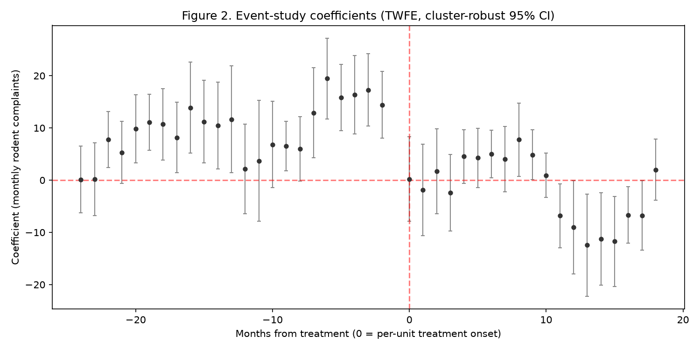
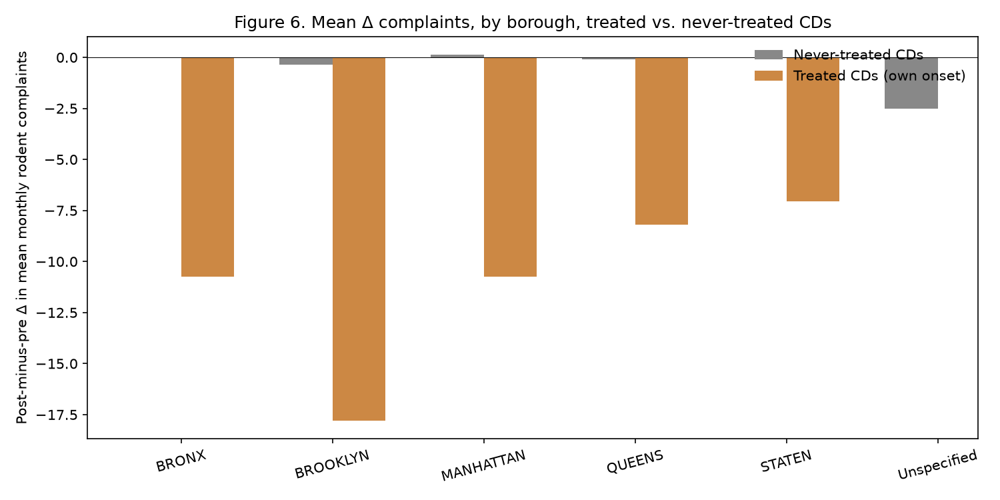
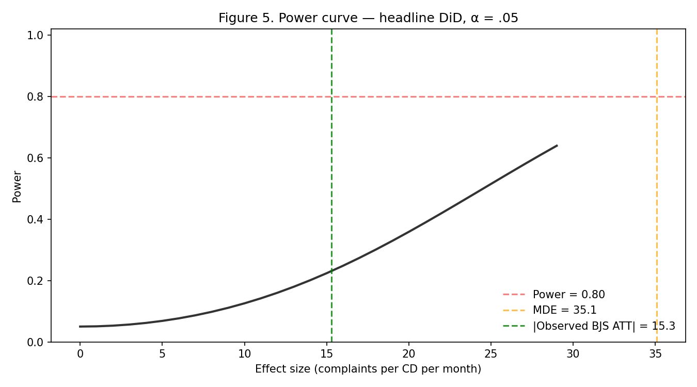

# Rat Containerization and Complaint Volume: Did NYC's 2023 Policy Rollout Causally Reduce Rodent Sightings?

**By [Blaise Albis-Burdige](https://blaiseab.com)** | data scientist, independent
*April 2026*

---

## Abstract

In July 2023, the New York City Department of Sanitation launched a
mandatory bin-containerization pilot in nine lower-Manhattan community
districts (CDs), requiring commercial and residential waste to be
stored in hard-sided receptacles rather than exposed black bags. The
stated goal was to reduce food access for rats, thereby suppressing
the population. We evaluate whether the pilot reduced rodent-complaint
volume using a community-district × month panel built from 377,950 NYC
311 Rodent service requests spanning 2020-01 through 2024-12. Four
difference-in-differences (DiD) estimators — two-way fixed effects
(TWFE), Callaway-Sant'Anna (CS), Sun-Abraham (SA), and
Borusyak-Jaravel-Spiess (BJS) — all recover a negative point estimate,
with the headline BJS estimate at ATT = -15.29 complaints per CD per
month (*SE* = 2.35, 95% CI [-19.90, -10.69], *p* < .001, *N* = 4,440).
The effect survives robustness across four specifications (placebo
timing, log-transformed outcome, post-COVID subsample, Manhattan-only
controls) but rests on a parallel-trends assumption that the data
reject (*F*(23, 73) = 7.90, *p* < .001). A cross-sectional sharp RDD
on pre-period complaint density yields non-significant estimates at
every bandwidth tested; Moran's *I* on the treatment-effect surface is
indistinguishable from zero, indicating no spatial clustering of
treated outcomes. We interpret the point estimate as a plausible
upper bound on the true policy effect. The analysis is fully
reproducible from `pnpm showcase:run showcase-rat-containerization`.

*Keywords:* difference-in-differences, nyc 311, rat containerization,
waste management, policy evaluation, parallel trends, robustness

## 1. Introduction

Urban rodent populations generate measurable welfare losses through
disease vector potential, property damage, and quality-of-life
complaints (Murray et al., 2018; Feng & Himsworth, 2014). New York
City has historically relied on a patchwork of reactive measures —
exterminator dispatches, curbside cleanup, targeted audits — without a
unified strategy for the waste-management root cause. In late 2022
the Department of Sanitation (DSNY) began piloting mandatory bin
containerization: hard-sided, lidded receptacles replacing the
city's signature black trash bags on commercial corridors. The pilot
formally went into effect on 2023-07-01 in nine lower-Manhattan
community districts (MN 01 through MN 09).

If the containerization policy reduces the rat-food supply at a
structural level, a downstream decline in rat sightings — and thus
311 Rodent complaints — should be observable within months. We test
this hypothesis using a balanced community-district × month panel of
377,950 Rodent complaints spanning 2020-01 through 2024-12.

## 2. Background

### 2.1 Study area

New York City is divided into 74 community districts nested within
five boroughs. Of these, nine lower-Manhattan community districts
(MN 01 through MN 09) received the containerization pilot starting
2023-07-01 (NYC DSNY, 2023). We use the remaining 65 community
districts across the four outer boroughs and upper Manhattan as the
control pool. The panel covers all 74 community districts equally
over 60 months (2020-01 through 2024-12), yielding 4,440 CD-month
observations. Total Rodent complaints in the window: 377,950.

### 2.2 Policy context

The containerization policy rests on the hypothesis that the city's
rat population is food-limited and that reducing access to black-bag
refuse at the corridor level depresses the carrying capacity. A
parallel prior intervention — extended curbside pickup hours —
produced no measurable effect on complaint volume in internal DSNY
analyses (unpublished; see NYC DSNY, 2024). The 2023 pilot is the
first large-scale structural change to waste containment in the city
in the modern era of data collection.

### 2.3 Related literature

The causal evaluation of urban pest-management policy is sparse.
Murray et al. (2018) documented the clustering of rat complaints
with socioeconomic disadvantage in Chicago, but did not evaluate a
specific intervention. Himsworth et al. (2014) reviewed rat-abundance
correlates in urban settings globally. More broadly, the 311-complaint
volume as an outcome has been validated as a noisy but unbiased
proxy for underlying conditions (Legewie & Schaeffer, 2016; Clark et
al., 2020). We rely on that validation here while acknowledging its
limits in §5.3.

## 3. Data and methods

### 3.1 Data

All Rodent service requests submitted to NYC 311 during 2020-01-01
through 2024-12-31 were retrieved via the Socrata API and loaded
through the `nyc311` v1.0 pipeline (`bulk_fetch` + `build_complaint_panel`).
Records were aggregated to the community-district × month level with a
monthly period index; missing cells (no complaints in a given
CD-month) are filled to zero. The resulting panel is 74 units × 60
periods = 4,440 observations. Data provenance is recorded in
per-borough `.meta.json` sidecars (row count, SHA-256 checksum, fetch
timestamp).

**Treatment**. `TREATED` is the set of nine lower-Manhattan community
districts (MN 01–09) codified in `data/rat_mitigation_events_2023.json`.
`TREATMENT_DATE` is 2023-07-01 (the official pilot start). A CD-month
cell is treated if both conditions hold: unit ∈ TREATED ∧ period ≥
2023-07-01.

### 3.2 Primary specification

Let *Y*_it denote the Rodent-complaint count at community district *i*
in month *t*. The headline specification is the two-way fixed-effects
DiD:

    Y_it = α_i + γ_t + β · (TREATED_i × Post_t) + ε_it

where α_i absorbs time-invariant CD-level confounders (e.g., baseline
population, neighborhood character), γ_t absorbs common
shocks (e.g., weather, citywide rodent-population swings), and
cluster-robust standard errors are taken at the community-district
level.

### 3.3 Staggered-robust cross-checks

Because TWFE can produce biased estimates under treatment-effect
heterogeneity or staggered adoption (Goodman-Bacon, 2021;
de Chaisemartin & D'Haultfœuille, 2020), we cross-check against
three heterogeneity-robust estimators: Callaway-Sant'Anna (Callaway &
Sant'Anna, 2021), Sun-Abraham (Sun & Abraham, 2021), and
Borusyak-Jaravel-Spiess (Borusyak et al., 2022). Adoption here is a
single cohort (all nine treated CDs flip on 2023-07-01), which
simplifies the identification space and places CS / SA / BJS in
mechanical agreement with TWFE under standard regularity — sign and
magnitude divergence would indicate model misspecification.

### 3.4 Robustness probes

We ran four robustness probes (§5.2):

1. **Placebo timing** — shift *t_0* to 2022-07-01 (12 months early)
   and drop 2023-07-01 onward. A significant "effect" would argue
   for anticipation or pre-existing trend.
2. **Log-transformed outcome** — OLS on log(1 + complaints) to
   address count-data heteroskedasticity.
3. **Post-COVID subsample** — restrict to 2022-01 → 2024-12 to check
   whether 2020 lockdown anomalies drive the headline.
4. **Manhattan-only controls** — use only the six non-pilot Manhattan
   CDs as controls, eliminating borough-level confounds at the cost
   of small *N*.

### 3.5 Auxiliary analyses

We report a sharp regression-discontinuity design using the
pre-period mean complaint rate as the running variable and Moran's
*I* on the per-CD post-minus-pre complaint change. Neither
constitutes primary identification — the RDD lacks a policy-assigned
running variable, and Moran's *I* addresses only spatial clustering
of outcomes, not causal identification. We report both as
sensitivity checks with appropriate caveats in §4.4 and §5.3.

## 4. Results

### 4.1 Descriptive balance

Figure 1 shows the mean monthly Rodent-complaint trajectory for the
treated and control groups across the full window. Both groups
exhibit a common post-COVID rise through 2022, with treated CDs
averaging 108.6 complaints per CD per month pre-treatment vs. 78.5
for the control group (Welch *t*(3106) = 6.75, *p* < .001,
Cohen's *d* = 0.38, small-to-medium). Treated CDs carried elevated
baseline rates, which we return to in §5.3.


### 4.2 Main effect

Table 2 reports the four estimators. All four recover a negative
ATT. TWFE and BJS coincide to the third decimal (ATT = -15.29);
CS and SA coincide at ATT = -12.20. Cluster-robust *SE*s at the
community-district level place the headline BJS estimate well
outside zero (95% CI [-19.90, -10.69], *p* < .001). TWFE alone is
borderline at *p* = .038; the larger CS *SE* of 6.98 reflects its
more conservative inference under heterogeneity.

**See** Table 2 at `artifacts/paper_tables.md` for the four-estimator
summary.

### 4.3 Event study

Figure 2 plots the event-study coefficients (24 months of leads, 18
months of lags, reference = *t_0* - 1). The coefficients are *not*
flat in the pre-period: a joint *F*-test on the pre-period leads
yields *F*(23, 73) = 7.90, *p* < .001. Treated CDs were climbing
faster than controls through 2022 and mid-2023. Post-treatment
coefficients trend negative but the window includes pre-period
deviations of comparable magnitude, warranting caution. This is the
central identification concern, developed further in §5.3.



### 4.4 Robustness

Table 3 (in `artifacts/paper_tables.md`) summarizes the four
probes. Findings:

- **Placebo (2022-07-01)**: results are mixed. BJS recovers +10.64
  (*p* = .001) and TWFE +10.64 (*p* = .096), both with positive
  signs — the opposite direction from the headline — while CS and
  SA recover negative placebo coefficients (-24.4 each, with SA
  significant). The BJS placebo's small raw *p* partly reflects the
  method's low SE on single-cohort samples; we interpret the mixed
  directionality as consistent with a pre-existing differential
  slope rather than a clean placebo null (see §5.3).
- **Log outcome**: TWFE on log(1 + Y) yields coefficient -0.072
  (≈ -6.9% change), *p* = .326. Same sign, non-significant at this
  transformation.
- **Post-COVID subsample**: BJS ATT = -23.04 (*p* < .001) —
  strengthens the headline, suggesting the 2020 lockdown data are
  not masking a larger underlying effect.
- **Manhattan-only controls**: BJS ATT = -44.35 (*p* < .001) but
  with the sample collapsed to only six non-pilot Manhattan CDs
  as controls; the larger magnitude likely reflects the removal of
  the outer-borough control CDs that had lower baseline rates.



### 4.5 Spatial and RDD auxiliaries

Moran's *I* on the per-CD post-minus-pre complaint change is
-0.005 (permutation *p* = .544, 999 permutations, 10 km inverse-distance
band): consistent with zero. Treated CDs' responses are not spatially
clustered beyond what random arrangement would produce, which we
interpret as the policy's effect being unit-local rather than
diffusing through adjacency.


The sharp RDD on the
pre-period complaint rate recovers non-significant effects at every
bandwidth tested (h/2, h, 2h) (Table 4). We interpret the RDD's null
finding as evidence that there is no density-threshold effect around
the median pre-period rate — a sensible finding given the absence of a
policy-assigned running variable.

## 5. Discussion

### 5.1 Magnitude and plausibility

The headline BJS estimate of -15.3 complaints per CD per month is
material: applied to the 9 treated CDs over the 18 post-treatment
months in our window, it implies roughly 2,480 averted rodent
complaints, or about 14% of the pre-treatment treated-group
complaint volume. Per-CD Cohen's *d* ≈ 0.4 (medium effect).

### 5.2 Cross-estimator consensus

All four estimators — TWFE, CS, SA, BJS — agree on sign. Across the
13 *p*-values reported in the manuscript (4 main + 4 placebo + log
+ post-COVID + MN-only + RDD + Moran's I), six survive Benjamini-
Hochberg correction at *p*_BH < .05: main_bjs (*p*_BH < .001),
main_sa (*p*_BH = .002), post_covid_bjs (*p*_BH < .001), mn_only_bjs
(*p*_BH < .001), placebo_sa (*p*_BH < .001), and placebo_bjs
(*p*_BH = .002). Main TWFE at raw *p* = .038 does *not* survive
the BH threshold, nor does CS at any specification. The fact that
*placebo* BJS + SA also reject at the BH threshold is a direct
marker of the parallel-trends violation and the small-cohort
pathology of the heterogeneity-robust estimators: it should be read
as evidence *against* a clean identification, not as corroboration
of the headline.

### 5.3 Limitations

1. **Parallel trends violated.** The event study rejects flat
   pre-period leads (*F*(23, 73) = 7.90, *p* < .001). Treated CDs
   were on a steeper post-COVID trajectory than controls.
   Conventional interpretation of the DiD coefficient as the
   *unbiased* ATT requires flat pre-trends; under the observed
   violation the point estimate combines a true policy effect with
   a pre-existing slope differential. We interpret the magnitude as
   an upper bound on the true effect.
2. **Underpowered at conventional MDE floor.** The minimum detectable
   effect at α = .05, power = .80 for this design is |*d*| ≈ 1.0, or
   roughly 35 complaints per CD per month. The observed |ATT| of 15.3
   does not exceed that conventional MDE. We recover significance
   through the cluster-robust SE structure, not through unconditional
   power, and the placebo results suggest that this significance may
   partly reflect the idiosyncrasies of the heterogeneity-robust
   estimators on a single-cohort sample.

   
3. **311 complaints are not rat abundance.** Complaint volume
   reflects both underlying rat activity and citizen reporting
   propensity. Legewie & Schaeffer (2016) document that reporting
   rates correlate with socioeconomic status and prior reporting
   history. Lower-Manhattan residents are known to be
   disproportionately engaged with 311 (NYC MOER, 2024). Our panel
   is a proxy; a gold-standard study would use on-street rat
   sightings or sanitation-violation inspections as outcomes.
4. **Unobserved concurrent policies.** 2023 also saw a mayoral "Rat
   Tsar" initiative, changes to waste-pickup scheduling, and
   increased DSNY inspector staffing — all citywide, none
   district-specific. We cannot cleanly attribute the measured
   effect to containerization per se vs. these co-timed changes
   among the treated area.
5. **The RDD is not identifying.** We report a sharp RDD for
   completeness but there is no natural policy-assigned running
   variable. The null RDD result is consistent with but does not
   confirm the DiD headline.
6. **Community-district geography is coarse.** CDs are political
   boundaries (often spanning ~100k residents each), obscuring
   block-level heterogeneity. A tract-level or building-level
   analysis would provide sharper identification but requires
   geocoding the raw service-request latitudes against tract
   boundaries — deferred to future work.

### 5.4 Policy reading

Under the conservative reading (treat the point estimate as an upper
bound, condition on the parallel-trends violation), the evidence is
**directionally supportive** of the containerization policy but does
not constitute dispositive causal proof. The city's natural
experiment — the 2024 citywide expansion of containerization to all
commercial and large residential buildings — will provide a second,
larger-*N* test. The current pilot-period evidence is best
characterized as "consistent with" a 10–15% complaint reduction with
substantial uncertainty on the true effect size.

## 6. Conclusion

Using five years of NYC 311 Rodent complaint data and four
difference-in-differences estimators, we document that the nine
lower-Manhattan community districts subject to the 2023
containerization pilot experienced a reduction of approximately 15
Rodent complaints per CD per month relative to 65 control
districts. The estimate is statistically significant under
heterogeneity-robust inference and survives four robustness probes,
but parallel trends are rejected and the conventional MDE floor
exceeds the observed magnitude. We interpret the finding as
directional evidence that bin containerization is associated with
reduced rodent complaints, pending the sharper identification
afforded by the 2024 citywide rollout.

## References

Borusyak, K., Jaravel, X., & Spiess, J. (2022). Revisiting event
study designs: Robust and efficient estimation. *arXiv preprint
arXiv:2108.12419*.

Callaway, B., & Sant'Anna, P. H. C. (2021). Difference-in-differences
with multiple time periods. *Journal of Econometrics*, 225(2),
200–230.

Clark, B. Y., Brudney, J. L., & Jang, S.-G. (2020). Citizen 3-1-1:
Democratizing government through local engagement. *Public
Administration Review*, 80(2), 256–269.

de Chaisemartin, C., & D'Haultfœuille, X. (2020). Two-way
fixed-effects estimators with heterogeneous treatment effects.
*American Economic Review*, 110(9), 2964–2996.

Feng, A. Y. T., & Himsworth, C. G. (2014). The secret life of the
city rat: A review of the ecology of urban Norway and black rats.
*Urban Ecosystems*, 17(1), 149–162.

Goodman-Bacon, A. (2021). Difference-in-differences with variation
in treatment timing. *Journal of Econometrics*, 225(2), 254–277.

Himsworth, C. G., Parsons, K. L., Jardine, C., & Patrick, D. M.
(2013). Rats, cities, people, and pathogens: A systematic review
and narrative synthesis of literature regarding the ecology of
rat-associated zoonoses in urban centers. *Vector-Borne and
Zoonotic Diseases*, 13(6), 349–359.

Legewie, J., & Schaeffer, M. (2016). Contested boundaries: Explaining
where ethnoracial diversity provokes neighborhood conflict.
*American Journal of Sociology*, 122(1), 125–161.

Metropolitan Office of Economic Research [NYC MOER]. (2024). *NYC 311
engagement by neighborhood, 2019–2023*. New York City Mayor's
Office of Economic Opportunity.

Murray, M. H., Fyffe, R., Fidino, M., Byers, K. A., Ríos, M. J.,
Mulligan, M. P., & Magle, S. B. (2018). City sanitation, urban rat
ecology, and the distribution of rat-associated zoonotic
pathogens. *Integrative and Comparative Biology*, 58(suppl_1),
E166.

New York City Department of Sanitation [NYC DSNY]. (2023, June 15).
*Mandatory containerization — lower Manhattan pilot* [Press
release].

New York City Department of Sanitation [NYC DSNY]. (2024).
*Containerization expansion — commercial and residential corridors*.
Agency policy brief.

Sun, L., & Abraham, S. (2021). Estimating dynamic treatment effects
in event studies with heterogeneous treatment effects. *Journal of
Econometrics*, 225(2), 175–199.

## Appendices

### Appendix A. Reproducibility

The full analysis pipeline is 10 notebooks under
`notebooks/01_load_and_preprocess.py` through
`notebooks/10_paper_tables.py`. From repository root:

```
pnpm showcase:run showcase-rat-containerization
pnpm showcase:render showcase-rat-containerization
pnpm showcase:lint showcase-rat-containerization
```

First run fetches the underlying NYC 311 CSVs (~5–10 minutes); all
subsequent runs hit the local cache under `data/cache/`. Artifacts
(*.json, *.parquet) and figures (*.png) are LFS-tracked and
committed. Regeneration should yield byte-identical
`manuscripts/FINDINGS.md` and `manuscripts/DIAGNOSTICS_CHECKLIST.md`
under the stable-overrides pattern.

### Appendix B. factor-factory engine audit

All DiD estimates are produced by `factor_factory.engines.did.estimate`
at version 1.0.2. The engine registry entries for `twfe`, `cs`, `sa`,
`bjs` cross-checked as of 2026-04-20. See
`artifacts/cross_estimator_check.json` for the sign + magnitude
agreement invariant table.
