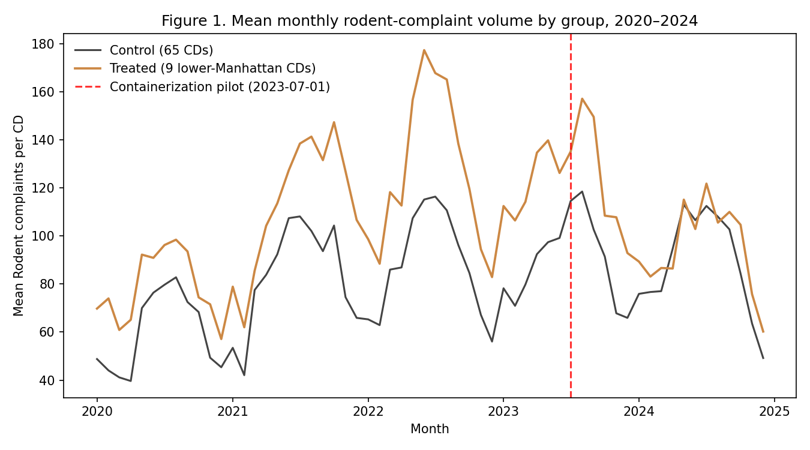

# 02 — Balance and parallel trends

> **Tearsheet** for [`notebooks/02_balance_and_pretrends.py`](../../notebooks/02_balance_and_pretrends.py) · [HTML report](../../site/02_balance_and_pretrends.html) · last run `2026-04-20T16:22:18+00:00`

Pre-treatment covariate balance (treated vs. control community
districts) and a parallel-trends visual for the headline monthly
complaint series. A parallel-trends visual that diverges
pre-treatment would undermine the identification strategy; a stable
common slope up to 2023-07-01 is the precondition for the DiD
headline in notebook 03.

**Pre-treatment balance: treated vs. control monthly rodent-complaint counts (2020-01 → 2023-06)**

| field | value |
| --- | --- |
| `group_means` | `[{'group': 'control', 'n_cells': 2730, 'mean_complaints': 78.473, 'sd_complaints': 75.334, 'median_complaints': 64.0}, {'group': 'treated', 'n_cells': 378, 'mean_complaints': 108.619, 'sd_complaints': 82.15, 'median_complaints': 90.0}]` |
| `welch_t.t_stat` | `6.752` |
| `welch_t.p_value` | `4.312e-11` |
| `welch_t.df_welch_approx` | `3106` |
| `welch_t.cohens_d` | `0.3825` |
| `welch_t.n_treated_cells` | `378` |
| `welch_t.n_control_cells` | `2730` |

**Next:** `03_main_effects.py` — four-estimator DiD on the containerization pilot.

---

*Auto-generated by `jellycell export tearsheet notebooks/02_balance_and_pretrends.py`. Regenerating overwrites this file — for hand-authored writeups put a `.md` at the root of `manuscripts/` instead of under `tearsheets/`.*
