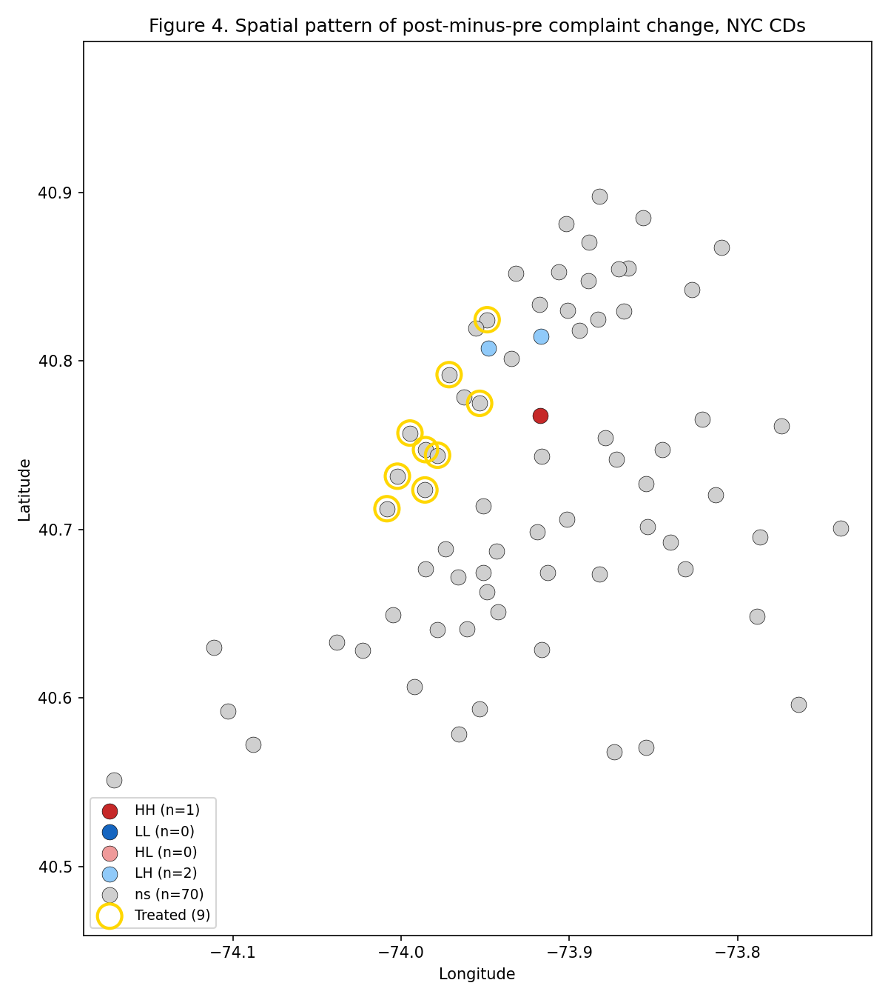

# 07 — RDD and spatial

> **Tearsheet** for [`notebooks/07_rdd_and_spatial.py`](../../notebooks/07_rdd_and_spatial.py) · [HTML report](../../site/07_rdd_and_spatial.html) · last run `2026-04-20T16:28:59+00:00`

Two auxiliary analyses:

1. **Sharp RDD on pre-period complaint rate** — a cross-sectional
   probe of whether CDs clustered just above the median pre-period
   complaint rate among Manhattan CDs responded differently from
   those just below. We do *not* claim this is the primary
   identification (there is no policy-assigned running variable); it
   is a discontinuity-based sensitivity check reported alongside the
   DiD headline.
2. **Moran's I on the treatment effect** — per-CD post-minus-pre
   change in complaint rate, mapped onto community-district
   centroids (derived from the latitude/longitude columns on the
   underlying service-request records). Tests whether the treatment
   effect is spatially clustered, i.e., whether neighboring
   treated-area CDs experienced correlated outcomes.

**Cross-sectional sharp RDD on pre-period complaint rate; sensitivity check only.**

| field | value |
| --- | --- |
| `running_variable` | pre_mean_complaint_rate |
| `cutoff` | `70.29` |
| `design` | sharp |
| `optimal_bandwidth_mserd` | `26.97` |
| `att_conventional` | `7.609` |
| `se` | `7.102` |
| `p_value` | `0.284` |
| `ci_95_low` | `-6.312` |
| `ci_95_high` | `21.53` |
| `n_effective_left` | `17` |
| `n_effective_right` | `13` |
| `bandwidth_sensitivity` | `[{'bandwidth_label': 'h/2', 'bandwidth': 13.486729622591511, 'att': 6.475945424374856, 'se': 9.793289510565424, 'p_value': 0.508443310263354}, {'bandwidth_label': 'h', 'bandwidth': 26.973459245183022, 'att': 7.608706961556294, 'se': 7.102363071131863, 'p_value': 0.2840380151483527}, {'bandwidth_label': '2h', 'bandwidth': 53.946918490366045, 'att': 2.5431966374827226, 'se': 6.7722955171491295, 'p_value': 0.7072667235110948}]` |
| `caveat` | No policy-assigned running variable exists. This RDD is a discontinuity-based… |

**Moran's I on the per-CD post-minus-pre complaint-rate change.**

| field | value |
| --- | --- |
| `morans_I` | `-0.005348` |
| `expectation_under_null` | `-0.01389` |
| `permutation_p_value` | `0.5435` |
| `n_permutations` | `999` |
| `n_units` | `73` |
| `distance_cutoff_km` | `10` |
| `weight_scheme` | inverse_distance_row_standardized |
| `interpretation` | Moran's *I* measures spatial autocorrelation of the post-minus-pre complaint-… |

**LISA cluster classification on treatment-effect surface (10km distance band).**

| field | value |
| --- | --- |
| `cluster_counts_all.ns` | `70` |
| `cluster_counts_all.LH` | `2` |
| `cluster_counts_all.HH` | `1` |
| `cluster_counts_treated.ns` | `9` |
| `n_units` | `73` |
| `n_treated` | `9` |

**Next:** `08_extended_robustness.py` — MDE + Benjamini-Hochberg on
the full robustness matrix.

---

*Auto-generated by `jellycell export tearsheet notebooks/07_rdd_and_spatial.py`. Regenerating overwrites this file — for hand-authored writeups put a `.md` at the root of `manuscripts/` instead of under `tearsheets/`.*
