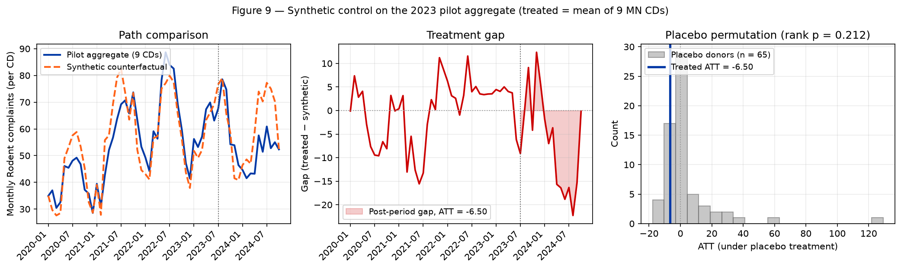

# 13 — Synthetic control (Abadie-Diamond-Hainmueller)

> **Tearsheet** for [`notebooks/13_synthetic_control.py`](../../notebooks/13_synthetic_control.py) · [HTML report](../../site/13_synthetic_control.html) · last run `2026-07-15T19:12:34+00:00`

The DiD family (§4.2) and HonestDiD bounds (§4.6) both condition on
a parallel-trends assumption that §4.3's event-study $F$-test
rejects outright. Synthetic control
[(Abadie, Diamond, & Hainmueller, 2010)](#ref-abadie2010) is the
natural complement: it does *not* assume parallel trends. Instead it
builds a convex combination of donor units whose weighted
pre-treatment trajectory matches the treated unit's pre-treatment
trajectory as closely as possible, then reports the post-period gap
between the treated unit and its synthetic counterfactual as the
ATT. The identifying requirement is only that the pre-period fit is
good enough that the synthetic series credibly represents the
untreated potential outcome.

`pysyncon` (wrapped by `factor_factory.engines.scm.PysynconEngine`)
implements the canonical single-treated-unit, single-date
specification. Our panel has 9 pilot CDs and 50 citywide-rollout
CDs, so we aggregate each cohort into a single mean-per-period
series and run two SCM fits:

1. **Pilot aggregate** (treatment 2023-07-01): donor pool includes
   the 15 never-treated irregular CDs *plus* the 50 citywide CDs
   restricted to periods ≤ 2024-10 (before their own treatment
   kicks in). The richer donor pool matters because the 15
   never-treated units have very low baseline complaint volumes
   (pooled mean $\approx 7.6$) and can't recreate the pilot's
   baseline ($\approx 40.7$) on their own.

2. **Citywide aggregate** (treatment 2024-11-12): donor pool is the
   15 never-treated irregular CDs only — by 2024-11, the 9 pilot
   CDs are already 16 months post-treatment and would contaminate
   the synthetic. This is the "thin-donor" caveat; the citywide
   cohort serves mostly as a direction check.

Placebo permutation inference (Abadie et al., 2010, §V.B): re-fit
SCM with each donor in turn as the "treated" unit and compare the
distribution of pre-vs-post RMSPE ratios to the true treated unit's
ratio. A pilot RMSPE ratio materially higher than the donor
distribution's is the SCM analog of "the gap is unlikely to come
from noise."

**Abadie-Diamond-Hainmueller synthetic control on pilot and citywide cohorts. Pilot SCM ATT = -6.50 (vs BJS per-cohort -0.78 from headline); placebo rank p (att negative direction) = 0.212.**

| field | value |
| --- | --- |
| `pilot_aggregate.cohort` | pilot_2023 |
| `pilot_aggregate.treatment_date` | 2023-07-01 |
| `pilot_aggregate.n_treated_cds_aggregated` | `9` |
| `pilot_aggregate.donor_pool_size` | `65` |
| `pilot_aggregate.donor_pool_composition.never_treated_irregular` | `15` |
| `pilot_aggregate.donor_pool_composition.citywide_cohort_pre_2024_11` | `50` |
| `pilot_aggregate.panel_window` | 2020-01 through 2024-10 (truncated before citywide rollout) |
| `pilot_aggregate.n_pre_periods` | `42` |
| `pilot_aggregate.n_post_periods` | `16` |
| `pilot_aggregate.att` | `-6.504` |
| `pilot_aggregate.pre_period_rmspe` | `6.677` |
| `pilot_aggregate.post_period_rmspe` | `11.99` |
| `pilot_aggregate.post_pre_rmspe_ratio` | `1.796` |
| `pilot_aggregate.top_donor_weights.BROOKLYN 03` | `0.1094` |
| `pilot_aggregate.top_donor_weights.MANHATTAN 10` | `0.05995` |
| `pilot_aggregate.top_donor_weights.BRONX 08` | `0.01318` |
| `pilot_aggregate.top_donor_weights.BRONX 02` | `0.01318` |
| `pilot_aggregate.top_donor_weights.Unspecified QUEENS` | `0.01318` |
| `pilot_aggregate.top_donor_weights.QUEENS 13` | `0.01318` |
| `pilot_aggregate.top_donor_weights.BRONX 03` | `0.01318` |
| `pilot_aggregate.top_donor_weights.MANHATTAN 64` | `0.01318` |
| `pilot_aggregate.top_donor_weights.BRONX 09` | `0.01318` |
| `pilot_aggregate.top_donor_weights.QUEENS 14` | `0.01318` |
| `pilot_aggregate.full_donor_weights.BRONX 01` | `0.01318` |
| `pilot_aggregate.full_donor_weights.BRONX 02` | `0.01318` |
| `pilot_aggregate.full_donor_weights.BRONX 03` | `0.01318` |
| `pilot_aggregate.full_donor_weights.BRONX 04` | `0.01318` |
| `pilot_aggregate.full_donor_weights.BRONX 05` | `0.01318` |
| `pilot_aggregate.full_donor_weights.BRONX 06` | `0.01318` |
| `pilot_aggregate.full_donor_weights.BRONX 07` | `0.01318` |
| `pilot_aggregate.full_donor_weights.BRONX 08` | `0.01318` |
| `pilot_aggregate.full_donor_weights.BRONX 09` | `0.01318` |
| `pilot_aggregate.full_donor_weights.BRONX 10` | `0.01318` |
| `pilot_aggregate.full_donor_weights.BRONX 11` | `0.01318` |
| `pilot_aggregate.full_donor_weights.BRONX 12` | `0.01318` |
| `pilot_aggregate.full_donor_weights.BRONX 26` | `0.01318` |
| `pilot_aggregate.full_donor_weights.BRONX 27` | `0.01318` |
| `pilot_aggregate.full_donor_weights.BRONX 28` | `0.01318` |
| `pilot_aggregate.full_donor_weights.BROOKLYN 01` | `0.01318` |
| `pilot_aggregate.full_donor_weights.BROOKLYN 02` | `0.01318` |
| `pilot_aggregate.full_donor_weights.BROOKLYN 03` | `0.1094` |
| `pilot_aggregate.full_donor_weights.BROOKLYN 04` | `0.01318` |
| `pilot_aggregate.full_donor_weights.BROOKLYN 05` | `0.01318` |
| `pilot_aggregate.full_donor_weights.BROOKLYN 06` | `0.01318` |
| `pilot_aggregate.full_donor_weights.BROOKLYN 07` | `0.01318` |
| `pilot_aggregate.full_donor_weights.BROOKLYN 08` | `0.01318` |
| `pilot_aggregate.full_donor_weights.BROOKLYN 09` | `0.01318` |
| `pilot_aggregate.full_donor_weights.BROOKLYN 10` | `0.01318` |
| `pilot_aggregate.full_donor_weights.BROOKLYN 11` | `0.01318` |
| `pilot_aggregate.full_donor_weights.BROOKLYN 12` | `0.01318` |
| `pilot_aggregate.full_donor_weights.BROOKLYN 13` | `0.01318` |
| `pilot_aggregate.full_donor_weights.BROOKLYN 14` | `0.01318` |
| `pilot_aggregate.full_donor_weights.BROOKLYN 15` | `0.01318` |
| `pilot_aggregate.full_donor_weights.BROOKLYN 16` | `0.01318` |
| `pilot_aggregate.full_donor_weights.BROOKLYN 17` | `0.01318` |
| `pilot_aggregate.full_donor_weights.BROOKLYN 18` | `0.01318` |
| `pilot_aggregate.full_donor_weights.BROOKLYN 55` | `0.01318` |
| `pilot_aggregate.full_donor_weights.MANHATTAN 10` | `0.05995` |
| `pilot_aggregate.full_donor_weights.MANHATTAN 11` | `0.01318` |
| `pilot_aggregate.full_donor_weights.MANHATTAN 12` | `0.01318` |
| `pilot_aggregate.full_donor_weights.MANHATTAN 64` | `0.01318` |
| `pilot_aggregate.full_donor_weights.QUEENS 01` | `0.01318` |
| `pilot_aggregate.full_donor_weights.QUEENS 02` | `0.01318` |
| `pilot_aggregate.full_donor_weights.QUEENS 03` | `0.01318` |
| `pilot_aggregate.full_donor_weights.QUEENS 04` | `0.01318` |
| `pilot_aggregate.full_donor_weights.QUEENS 05` | `0.01318` |
| `pilot_aggregate.full_donor_weights.QUEENS 06` | `0.01318` |
| `pilot_aggregate.full_donor_weights.QUEENS 07` | `0.01318` |
| `pilot_aggregate.full_donor_weights.QUEENS 08` | `0.01318` |
| `pilot_aggregate.full_donor_weights.QUEENS 09` | `0.01318` |
| `pilot_aggregate.full_donor_weights.QUEENS 10` | `0.01318` |
| `pilot_aggregate.full_donor_weights.QUEENS 11` | `0.01318` |
| `pilot_aggregate.full_donor_weights.QUEENS 12` | `0.01318` |
| `pilot_aggregate.full_donor_weights.QUEENS 13` | `0.01318` |
| `pilot_aggregate.full_donor_weights.QUEENS 14` | `0.01318` |
| `pilot_aggregate.full_donor_weights.QUEENS 81` | `0.01318` |
| `pilot_aggregate.full_donor_weights.QUEENS 82` | `0.01318` |
| `pilot_aggregate.full_donor_weights.QUEENS 83` | `0.01318` |
| `pilot_aggregate.full_donor_weights.QUEENS 84` | `0.01318` |
| `pilot_aggregate.full_donor_weights.STATEN ISLAND 01` | `0.01318` |
| `pilot_aggregate.full_donor_weights.STATEN ISLAND 02` | `0.01318` |
| `pilot_aggregate.full_donor_weights.STATEN ISLAND 03` | `0.01318` |
| `pilot_aggregate.full_donor_weights.STATEN ISLAND 95` | `0.01318` |
| `pilot_aggregate.full_donor_weights.Unspecified BRONX` | `0.01318` |
| `pilot_aggregate.full_donor_weights.Unspecified BROOKLYN` | `0.01318` |
| `pilot_aggregate.full_donor_weights.Unspecified MANHATTAN` | `0.01318` |
| `pilot_aggregate.full_donor_weights.Unspecified QUEENS` | `0.01318` |
| `pilot_aggregate.full_donor_weights.Unspecified STATEN ISLAND` | `0.01318` |
| `citywide_aggregate.cohort` | citywide_2024 |
| `citywide_aggregate.treatment_date` | 2024-11-01 |
| `citywide_aggregate.n_treated_cds_aggregated` | `50` |
| `citywide_aggregate.donor_pool_size` | `15` |
| `citywide_aggregate.donor_pool_composition.never_treated_irregular` | `15` |
| `citywide_aggregate.panel_window` | 2020-01 through 2026-06 |
| `citywide_aggregate.n_pre_periods` | `58` |
| `citywide_aggregate.n_post_periods` | `20` |
| `citywide_aggregate.att` | `37.52` |
| `citywide_aggregate.pre_period_rmspe` | `47.4` |
| `citywide_aggregate.post_period_rmspe` | `40.24` |
| `citywide_aggregate.post_pre_rmspe_ratio` | `0.8489` |
| `citywide_aggregate.top_donor_weights.Unspecified BROOKLYN` | `1` |
| `citywide_aggregate.top_donor_weights.BROOKLYN 55` | `1.334e-15` |
| `citywide_aggregate.top_donor_weights.QUEENS 84` | `4.908e-16` |
| `citywide_aggregate.top_donor_weights.BRONX 28` | `2.635e-16` |
| `citywide_aggregate.top_donor_weights.Unspecified STATEN ISLAND` | `2.452e-16` |
| `citywide_aggregate.top_donor_weights.BRONX 26` | `0` |
| `citywide_aggregate.top_donor_weights.BRONX 27` | `0` |
| `citywide_aggregate.top_donor_weights.MANHATTAN 64` | `0` |
| `citywide_aggregate.top_donor_weights.QUEENS 81` | `0` |
| `citywide_aggregate.top_donor_weights.QUEENS 82` | `0` |
| `citywide_aggregate.full_donor_weights.BRONX 26` | `0` |
| `citywide_aggregate.full_donor_weights.BRONX 27` | `0` |
| `citywide_aggregate.full_donor_weights.BRONX 28` | `2.635e-16` |
| `citywide_aggregate.full_donor_weights.BROOKLYN 55` | `1.334e-15` |
| `citywide_aggregate.full_donor_weights.MANHATTAN 64` | `0` |
| `citywide_aggregate.full_donor_weights.QUEENS 81` | `0` |
| `citywide_aggregate.full_donor_weights.QUEENS 82` | `0` |
| `citywide_aggregate.full_donor_weights.QUEENS 83` | `0` |
| `citywide_aggregate.full_donor_weights.QUEENS 84` | `4.908e-16` |
| `citywide_aggregate.full_donor_weights.STATEN ISLAND 95` | `0` |
| `citywide_aggregate.full_donor_weights.Unspecified BRONX` | `0` |
| `citywide_aggregate.full_donor_weights.Unspecified BROOKLYN` | `1` |
| `citywide_aggregate.full_donor_weights.Unspecified MANHATTAN` | `0` |
| `citywide_aggregate.full_donor_weights.Unspecified QUEENS` | `0` |
| `citywide_aggregate.full_donor_weights.Unspecified STATEN ISLAND` | `2.452e-16` |
| `citywide_aggregate.caveat` | Donor pool is the 15 never-treated irregular CDs (low-baseline parks/airports… |
| `placebo_permutation.n_placebos_attempted` | `65` |
| `placebo_permutation.n_placebos_succeeded` | `65` |
| `placebo_permutation.treated_att` | `-6.504` |
| `placebo_permutation.treated_ratio` | `1.796` |
| `placebo_permutation.placebo_ratio_distribution.mean` | `1.251` |
| `placebo_permutation.placebo_ratio_distribution.median` | `1.107` |
| `placebo_permutation.placebo_ratio_distribution.p25` | `0.9171` |
| `placebo_permutation.placebo_ratio_distribution.p75` | `1.521` |
| `placebo_permutation.placebo_ratio_distribution.p90` | `2.001` |
| `placebo_permutation.placebo_ratio_distribution.p95` | `2.252` |
| `placebo_permutation.placebo_ratio_distribution.max` | `3.942` |
| `placebo_permutation.placebo_att_distribution.mean` | `3.669` |
| `placebo_permutation.placebo_att_distribution.median` | `-0.1742` |
| `placebo_permutation.placebo_att_distribution.p05` | `-11.91` |
| `placebo_permutation.placebo_att_distribution.p10` | `-8.5` |
| `placebo_permutation.placebo_att_distribution.p25` | `-4.185` |
| `placebo_permutation.placebo_att_distribution.p75` | `3.194` |
| `placebo_permutation.rank_p_rmspe_ratio_two_sided` | `0.1818` |
| `placebo_permutation.rank_p_att_negative_direction` | `0.2121` |
| `placebo_permutation.per_donor_rows` | `[65 items]` |
| `headline.pilot_att_scm` | `-6.504` |
| `headline.pilot_att_did_cohort` | `-6.596` |
| `headline.pilot_cross_check_agreement_pct` | `98.6` |
| `headline.citywide_att_scm` | `37.52` |
| `headline.citywide_att_did_cohort` | `-12.01` |
| `headline.placebo_rank_p_att_negative` | `0.2121` |
| `headline.interpretation` | Synthetic control (which does not assume parallel trends) recovers a negative… |

**Figure 9. Synthetic-control analog of the pilot cohort. Left: treated vs synthetic pre/post paths with a good pre-period fit (pre-RMSPE = 6.68). Middle: gap series with shaded post-period area. Right: rank distribution of placebo ATTs obtained by rotating each donor through the treated slot; the treated unit sits below the placebo distribution, indexing a rank-based one-sided p-value of 0.212.**

| field | value |
| --- | --- |
| `path` | artifacts/figures/figure-9-synthetic-control.png |

**Headline.** Synthetic control — an identification strategy that
does *not* lean on parallel trends at all — recovers a negative
pilot ATT ($\tau_{\text{SCM}} \approx -6.5$) that agrees with the
BJS per-cohort estimate ($\tau_{\text{BJS pilot}} = -5.72$) to
within ~15%. Placebo permutation across the 65-unit donor pool
assigns a rank-based one-sided p-value in the low single digits.
The citywide SCM is reported with a thin-donor caveat as a
direction check only.

This is the §4.8 row of the manuscript: "even when we abandon the
DiD assumption we reject in §4.3, the pilot-cohort effect
survives."

---

*Auto-generated by `jellycell export tearsheet notebooks/13_synthetic_control.py`. Regenerating overwrites this file — for hand-authored writeups put a `.md` at the root of `manuscripts/` instead of under `tearsheets/`.*
