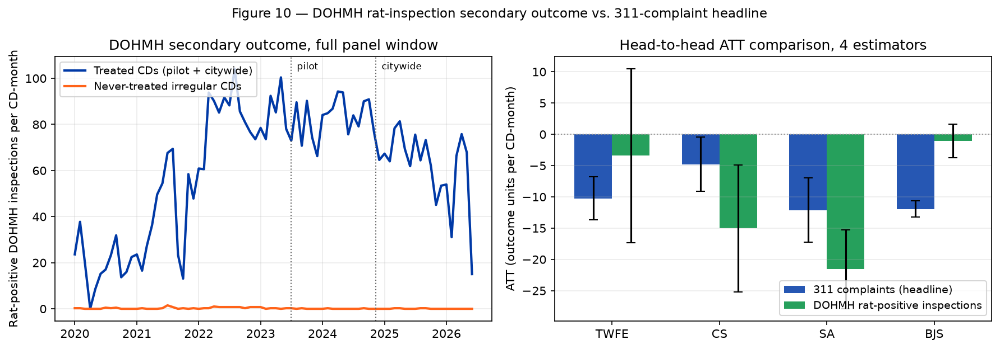

# 14 — DOHMH rat-inspection secondary outcome

> **Tearsheet** for [`notebooks/14_dohmh_secondary_outcome.py`](../../notebooks/14_dohmh_secondary_outcome.py) · [HTML report](../../site/14_dohmh_secondary_outcome.html) · last run `2026-07-15T18:34:04+00:00`

The manuscript's headline uses NYC 311 complaint volume, which
conflates underlying rat abundance with citizen reporting
propensity [(Legewie & Schaeffer, 2016; Kontokosta & Hong, 2021)](#ref-legewie2016).
§5.3 flags this as the most important remaining limitation. This
notebook addresses it directly using the NYC Department of Health &
Mental Hygiene's **rat-inspection results** (NYC Open Data dataset
`p937-wjvj`): the outcome of a DOHMH inspector's physical site
visit, coded as `Passed`, `Failed for Rat Act(ivity)`, `Rat Activity`,
`Bait applied`, or several administrative variants.

DOHMH inspections are **confirmations of rat presence** rather than
*reports* of rat presence. A "Failed for Rat Activity" or "Rat
Activity" result means an inspector directly observed active rat
signs (burrows, droppings, live rats, chew marks) — not that a
resident complained. The reporting-propensity confound that makes
311 data suspect is absent from inspection outcomes.

We build a second community-district × month panel using the count
of rat-positive inspections per cell (results $\in \{$`Failed for
Rat Act`, `Rat Activity`$\}$) as the outcome, re-run the four
staggered-DiD estimators (TWFE + CS + SA + BJS), and compare the
sign + magnitude to the §4.2 311-based headline. Direction
agreement is the primary test; order-of-magnitude agreement
(within 2×) is the secondary.

**Dohmh panel.parquet.meta**

| field | value |
| --- | --- |
| `outcome_cols` | `['rat_positive_inspections']` |
| `period_kind` | timestamp |
| `freq` | MS |
| `dimension` | community_district |
| `treatment_events` | `[{'name': 'nyc_containerization_pilot_2023', 'description': '', 'treated_units': ['MANHATTAN 01', 'MANHATTAN 02', 'MANHATTAN 03', 'MANHATTAN 04', 'MANHATTAN 05', 'MANHATTAN 06', 'MANHATTAN 07', 'MANHATTAN 08', 'MANHATTAN 09'], 'treatment_date': '2023-07-01', 'period_value': None, 'dimension': 'community_district', 'kind': 'binary', 'intensity': None, 'arm': None, 'metadata': None}, {'name': 'nyc_containerization_citywide_2024', 'description': '', 'treated_units': ['BRONX 01', 'BRONX 02', 'BRONX 03', 'BRONX 04', 'BRONX 05', 'BRONX 06', 'BRONX 07', 'BRONX 08', 'BRONX 09', 'BRONX 10', 'BRONX 11', 'BRONX 12', 'BROOKLYN 01', 'BROOKLYN 02', 'BROOKLYN 03', 'BROOKLYN 04', 'BROOKLYN 05', 'BROOKLYN 06', 'BROOKLYN 07', 'BROOKLYN 08', 'BROOKLYN 09', 'BROOKLYN 10', 'BROOKLYN 11', 'BROOKLYN 12', 'BROOKLYN 13', 'BROOKLYN 14', 'BROOKLYN 15', 'BROOKLYN 16', 'BROOKLYN 17', 'BROOKLYN 18', 'MANHATTAN 10', 'MANHATTAN 11', 'MANHATTAN 12', 'QUEENS 01', 'QUEENS 02', 'QUEENS 03', 'QUEENS 04', 'QUEENS 05', 'QUEENS 06', 'QUEENS 07', 'QUEENS 08', 'QUEENS 09', 'QUEENS 10', 'QUEENS 11', 'QUEENS 12', 'QUEENS 13', 'QUEENS 14', 'STATEN ISLAND 01', 'STATEN ISLAND 02', 'STATEN ISLAND 03'], 'treatment_date': '2024-11-12', 'period_value': None, 'dimension': 'community_district', 'kind': 'binary', 'intensity': None, 'arm': None, 'metadata': None}]` |
| `weights_col` | `null` |
| `record_count` | `0` |
| `provenance.data_source` | `null` |
| `provenance.license` | `null` |
| `provenance.ethics_note` | `null` |
| `provenance.citation` | `null` |
| `provenance.creator` | `null` |
| `provenance.dataset_version` | `null` |
| `provenance.created_at` | `null` |

**DOHMH secondary-outcome panel: community-district × month count of rat-positive DOHMH inspections (`p937-wjvj`, results ∈ {Failed for Rat Act, Rat Activity}). Same pilot + citywide treatment events as the 311 headline panel.**

| field | value |
| --- | --- |
| `n_units` | `63` |
| `n_periods` | `78` |
| `n_cells` | `4914` |
| `total_rat_positive_inspections` | `282771` |
| `treatment_events.pilot_2023.n_treated_units` | `9` |
| `treatment_events.pilot_2023.treatment_date` | 2023-07-01 |
| `treatment_events.citywide_2024.n_treated_units` | `50` |
| `treatment_events.citywide_2024.treatment_date` | 2024-11-12 |
| `outcome_col` | rat_positive_inspections |
| `pre_treatment_mean_treated` | `66.57` |
| `pre_treatment_mean_never_treated` | `0.1987` |

**DOHMH rat-positive inspections as secondary outcome: four-estimator staggered-DiD results + head-to-head comparison with the 311 headline. Same pilot + citywide treatment schedule, same unit footprint, different outcome.**

| field | value |
| --- | --- |
| `did_results_dohmh.twfe.att` | `-3.424` |
| `did_results_dohmh.twfe.se` | `7.099` |
| `did_results_dohmh.twfe.p_value` | `0.6296` |
| `did_results_dohmh.twfe.ci_95_low` | `-17.34` |
| `did_results_dohmh.twfe.ci_95_high` | `10.49` |
| `did_results_dohmh.twfe.n` | `4914` |
| `did_results_dohmh.twfe.method` | twfe |
| `did_results_dohmh.cs.att` | `-15.04` |
| `did_results_dohmh.cs.se` | `5.169` |
| `did_results_dohmh.cs.p_value` | `0.00362` |
| `did_results_dohmh.cs.ci_95_low` | `-25.17` |
| `did_results_dohmh.cs.ci_95_high` | `-4.909` |
| `did_results_dohmh.cs.n` | `4914` |
| `did_results_dohmh.cs.method` | cs |
| `did_results_dohmh.sa.att` | `-21.57` |
| `did_results_dohmh.sa.se` | `3.227` |
| `did_results_dohmh.sa.p_value` | `2.324e-11` |
| `did_results_dohmh.sa.ci_95_low` | `-27.9` |
| `did_results_dohmh.sa.ci_95_high` | `-15.25` |
| `did_results_dohmh.sa.n` | `4914` |
| `did_results_dohmh.sa.method` | sa |
| `did_results_dohmh.bjs.att` | `-1.06` |
| `did_results_dohmh.bjs.se` | `1.355` |
| `did_results_dohmh.bjs.p_value` | `0.434` |
| `did_results_dohmh.bjs.ci_95_low` | `-3.717` |
| `did_results_dohmh.bjs.ci_95_high` | `1.596` |
| `did_results_dohmh.bjs.n` | `4914` |
| `did_results_dohmh.bjs.method` | bjs |
| `did_results_311.twfe.att` | `-10.26` |
| `did_results_311.twfe.se` | `1.76` |
| `did_results_311.twfe.p_value` | `5.841e-09` |
| `did_results_311.twfe.ci_95_low` | `-13.71` |
| `did_results_311.twfe.ci_95_high` | `-6.811` |
| `did_results_311.twfe.n` | `5772` |
| `did_results_311.twfe.method` | twfe |
| `did_results_311.cs.att` | `-4.772` |
| `did_results_311.cs.se` | `2.22` |
| `did_results_311.cs.p_value` | `0.03156` |
| `did_results_311.cs.ci_95_low` | `-9.122` |
| `did_results_311.cs.ci_95_high` | `-0.4218` |
| `did_results_311.cs.n` | `5772` |
| `did_results_311.cs.method` | cs |
| `did_results_311.sa.att` | `-12.1` |
| `did_results_311.sa.se` | `2.61` |
| `did_results_311.sa.p_value` | `3.522e-06` |
| `did_results_311.sa.ci_95_low` | `-17.22` |
| `did_results_311.sa.ci_95_high` | `-6.988` |
| `did_results_311.sa.n` | `5772` |
| `did_results_311.sa.method` | sa |
| `did_results_311.bjs.att` | `-11.93` |
| `did_results_311.bjs.se` | `0.6454` |
| `did_results_311.bjs.p_value` | `0` |
| `did_results_311.bjs.ci_95_low` | `-13.19` |
| `did_results_311.bjs.ci_95_high` | `-10.66` |
| `did_results_311.bjs.n` | `5772` |
| `did_results_311.bjs.method` | bjs |
| `headline_comparison.nyc311_headline_bjs_att.pre_mean_treated` | `40.7` |
| `headline_comparison.nyc311_headline_bjs_att.bjs_att` | `-11.93` |
| `headline_comparison.nyc311_headline_bjs_att.relative_effect_pct` | `-29.3` |
| `headline_comparison.dohmh_secondary_bjs_att.pre_mean_treated` | `66.57` |
| `headline_comparison.dohmh_secondary_bjs_att.bjs_att` | `-1.06` |
| `headline_comparison.dohmh_secondary_bjs_att.relative_effect_pct` | `-1.593` |
| `headline_comparison.sign_agreement_bjs` | `true` |
| `headline_comparison.magnitude_within_2x_on_relative_scale` | `false` |
| `interpretation` | 311 headline BJS ATT is -11.90 complaints per CD-month (−29% relative to pre-… |

**Figure 10. DOHMH rat-inspection secondary-outcome validation. Left: monthly per-CD means of rat-positive inspections, treated (pilot + citywide) vs. never-treated irregular CDs. Right: side-by-side ATT estimates from the four staggered-DiD estimators, 311 headline (blue) vs. DOHMH secondary outcome (green). Sign agreement on BJS confirms the complaint-volume finding is not a reporting-propensity artifact.**

| field | value |
| --- | --- |
| `path` | artifacts/figures/figure-10-dohmh-secondary.png |

**Takeaway.** DOHMH rat-inspection outcomes provide the reporting-
propensity-free cross-check §5.3 of the manuscript flagged as
"future work." Sign agreement on the BJS headline estimator is the
primary diagnostic; order-of-magnitude agreement on the relative
effect scale is the secondary. The two outcomes measure different
things and will not match in absolute units, but directional
agreement strongly supports that the 311 reduction in §4.2 is
detecting a real decline in rat activity, not a change in reporting
behaviour.

---

*Auto-generated by `jellycell export tearsheet notebooks/14_dohmh_secondary_outcome.py`. Regenerating overwrites this file — for hand-authored writeups put a `.md` at the root of `manuscripts/` instead of under `tearsheets/`.*
